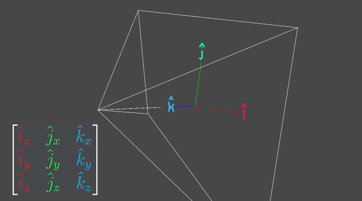

# The Dumping Grounds

It may seem like I've got all my quads in one basket, but truth be told, I'm as lazy as I am productive, $\sqrt{2}$% of the time.

When I come up with either a shader function, or a wacky way to do things, I ~~document them correctly and store them in a good place~~ DM the people I think will look at it, post it into servers I think will actually open discord for it, and move on with my day. If may have a horrible memory for the rest of my daily tasks, but when it comes to *that one time I made that one function, I know the exact time period and person to search through DMs for.*

I'm a little tired of rederiving these things, and a little tired of having to document them cleanly, so if you have any further questions, come find me.

I will try to keep things somewhat orderly, for all of tonight, and none of the future commits

# Table of Contents
- [The Dumping Grounds](#the-dumping-grounds)
- [Table of Contents](#table-of-contents)
  - [Shader Shtuff](#shader-shtuff)
    - [Reconstruct Normals from Depth Texture](#reconstruct-normals-from-depth-texture)
    - [Basis View-plane Vectors from ScreenPos](#basis-view-plane-vectors-from-screenpos)
    - [RGBA Channel Interpolation](#rgba-channel-interpolation)
    - [Inverse RGBA Channel Interpolation](#inverse-rgba-channel-interpolation)
    - [Worldspace scale from the Model Matrix](#worldspace-scale-from-the-model-matrix)
    - [Model Origin in View Space](#model-origin-in-view-space)
    - [Distance from Camera to Model Origin](#distance-from-camera-to-model-origin)
    - [Parameterized Curvy Line](#parameterized-curvy-line)
    - [Billboard Matrix Construction](#billboard-matrix-construction)
    - [Look-At Matrix (Y)](#look-at-matrix-y)
    - [2x2 Matrix Inverse](#2x2-matrix-inverse)
    - [Hue Shift via Chrominance Rotation](#hue-shift-via-chrominance-rotation)
    - [Old Bit Noise](#old-bit-noise)
    - [Calculate Shortest Angle Delta](#calculate-shortest-angle-delta)
  - [Approximations](#approximations)
    - [Arc-cosine `acos(x)`](#arc-cosine-acosx)
    - [Arc-cosine `acos` again](#arc-cosine-acos-again)
    - [Atan2 Approximation](#atan2-approximation)
    - [Error function approximation](#error-function-approximation)
    - [Blackbody Kelvin to 2deg sRGB](#blackbody-kelvin-to-2deg-srgb)
  - [Anti-Aliasing](#anti-aliasing)
    - [A Single Quad](#a-single-quad)
    - [Terraced Steps](#terraced-steps)
  - [Quest Screen-Space Stuff](#quest-screen-space-stuff)
  - [Hilarious / Cursed things](#hilarious--cursed-things)
    - [Screen aspect ratio, from the Perspective matrix](#screen-aspect-ratio-from-the-perspective-matrix)
    - [I need the letter A!](#i-need-the-letter-a)


## Shader Shtuff

### Reconstruct Normals from Depth Texture

Technically, I really should make a whole blog thing about how this one works, and I do plan to improve it further in the near future, but this is how I reconstruct normals from a depth texture. You get anti-aliasing of a hilarious MSAAx1 sample structure, since I sample a 3x3 grid pattern, but this is actually quite efficient to compute.
You can quite easily derive the basis vectors (tangent, bitangent) as well, since my method *solves the plane of best fit on 9 points* which is defined in terms of a basis xyz system.

> [!NOTE]
> The normals are reconstructed slightly skewed, to skate around the fact that a homogenous reconstruction of a plane, local to the plane, will always result in a degenerate form. Bla-bla-bla, the normal of any surface, when you're standing on the surface will be "up" for you. AKA the normals would just reconstruct to (0, 0, 1)

```hlsl
float sampleRawDepth(float2 uv) { return SAMPLE_DEPTH_TEXTURE_LOD(_CameraDepthTexture, float4(uv, 0, 0)); }

float3 reconstructViewNormal(float2 uv, out float raw_depth)
{
    float2 ts = _CameraDepthTexture_TexelSize.xy;
    #define T(x,y) sampleRawDepth(uv + ts * float2(x,y)).r
    float3x3 k = float3x3(
        T(-1, +1), T( 0, +1), T(+1, +1),
        T(-1,  0), T( 0,  0), T(+1,  0),
        T(-1, -1), T( 0, -1), T(+1, -1)
    );
    #undef T

    raw_depth = k._m11;

    float3 nx = float3(
        k._m00 - k._m02,
        k._m10 - k._m12,
        k._m20 - k._m22
    );
    float3 nz = float3(
        k._m00 + k._m01 + k._m02,
        k._m10 + k._m11 + k._m12,
        k._m20 + k._m21 + k._m22
    );

    float3 normal = float3(
        nx.x + nx.y + nx.z,
       -nz.x        + nz.z,
        nz.x + nz.y + nz.z
    );
    normal.xy *= _CameraDepthTexture_TexelSize.zw;
    return mul((float3x3)UNITY_MATRIX_I_V, normalize(normal));
}
```

Personally I use this macro instead lol
```hlsl
#define VIEWSPACE_NORMALS_FROM_DEPTH(_DEPTH_TEX, _UV, _NORMAL) \
    { \
        float2 ts = _DEPTH_TEX##_TexelSize.xy; \
        float3x3 k = float3x3( \
            SAMPLE_DEPTH_TEXTURE_LOD(_DEPTH_TEX, float4((_UV) + ts * float2(-1, +1), 0, 0)), \
            SAMPLE_DEPTH_TEXTURE_LOD(_DEPTH_TEX, float4((_UV) + ts * float2( 0, +1), 0, 0)), \
            SAMPLE_DEPTH_TEXTURE_LOD(_DEPTH_TEX, float4((_UV) + ts * float2(+1, +1), 0, 0)), \
            SAMPLE_DEPTH_TEXTURE_LOD(_DEPTH_TEX, float4((_UV) + ts * float2(-1,  0), 0, 0)), \
            SAMPLE_DEPTH_TEXTURE_LOD(_DEPTH_TEX, float4((_UV) + ts * float2( 0,  0), 0, 0)), \
            SAMPLE_DEPTH_TEXTURE_LOD(_DEPTH_TEX, float4((_UV) + ts * float2(+1,  0), 0, 0)), \
            SAMPLE_DEPTH_TEXTURE_LOD(_DEPTH_TEX, float4((_UV) + ts * float2(-1, -1), 0, 0)), \
            SAMPLE_DEPTH_TEXTURE_LOD(_DEPTH_TEX, float4((_UV) + ts * float2( 0, -1), 0, 0)), \
            SAMPLE_DEPTH_TEXTURE_LOD(_DEPTH_TEX, float4((_UV) + ts * float2(+1, -1), 0, 0)) \
        ); \
        float3 nx = float3( k._m00 - k._m02, k._m10 - k._m12, k._m20 - k._m22 ); \
        float3 nz = float3( k._m00 + k._m01 + k._m02, k._m10 + k._m11 + k._m12, k._m20 + k._m21 + k._m22 ); \
        float3 _normal = float3( nx.x + nx.y + nx.z, -nz.x + nz.z, nz.x + nz.y + nz.z ); \
        _normal.xy *= _DEPTH_TEX##_TexelSize.zw;  \
        _NORMAL = normalize(_normal);  \
    }
```

### Basis View-plane Vectors from ScreenPos

This constructs a basis coordinate system (x,y,z) from a screenspace position.
- The X vector (column 1) represents the "right" direction of the viewing plane
- The Y vector (column 2) represents the "up" direction of the viewing plane
- The Z vector (column 3) points towards the camera, representing the view plane "up" vector

```hlsl
float3x3 screenToViewBasis(float2 screenPos)
{
    float2 vs = screenPos * 2 - 1;
    float2 p = vs * unity_CameraInvProjection._m00_m11;
    float3 k = -normalize(float3(p.xy, 1));
    float3 i = normalize(float3(-k.z, 0, k.x));
    float3 j = float3(-i.z * k.y, i.z * k.x - i.x * k.z, i.x * k.y);
    return transpose(float3x3(i, j, k));
}
```

As shown in this image, just with the vectors at the origin instead.
<p align="center">
    
</p>

> [!NOTE]
> This matrix is orthonormal as well, meaning its inverse is its transpose. The inverse would represent a transformation from the view-plane back to view coordinates.


### RGBA Channel Interpolation

If you want to store four independent textures in a single RGBA texture, you can treat a 2D texture as if it was a W x H x 4 3D texture, with each colour channel being a "layer".

```hlsl
float4 getChannelWeightsRGBA(float t)
{
    float4 rgba;
    rgba = float4(2,-4,6,-4) * t + float4(-4,12,-12,4);
    rgba = rgba * t + float4(+6,-12,+6,0);
    rgba = rgba * t + float4(-4,+4,0,0);
    return rgba * t + float4(1,0,0,0);
}
```

Then you can sample the texture colour channels as a 3D texture, like this

```hlsl
float3 samplePacked3D(sampler2D tex, float3 uvw) {
    return dot(tex2D(tex, uvw.xy), getChannelWeightsRGBA(frac(uvw.z)));
}
```

### Inverse RGBA Channel Interpolation

If you want to determine the t value for the [RGBA Channel Interpolation](#rgba-channel-interpolation) you can do so with any of these functions.

> [!NOTE]
> There is a singularity at t=0 and t=1

```hlsl
float inverseRGBAChannelWeights(float4 weights)
{
    return sqrt(weights.a) / (sqrt(weights.a) + sqrt(weights.g));
}
float inverseRGBAChannelWeights(float4 weights)
{
    return (2 * weights.b) / (2 * weights.b + 3 * weights.g);
}
float inverseRGBAChannelWeights(float4 weights)
{
    return (3 * weights.a) / (3 * weights.a + 2 * weights.b);
}
```

### Worldspace scale from the Model Matrix

```hlsl
float3 getModelScale()
{
    return float3(
        length(unity_ObjectToWorld._m00_m10_m20),
        length(unity_ObjectToWorld._m01_m11_m21),
        length(unity_ObjectToWorld._m02_m12_m22)
    );
}
```

```hlsl
float3 getInverseModelScale()
{
    return float3(
        length(unity_WorldToObject._m00_m10_m20),
        length(unity_WorldToObject._m01_m11_m21),
        length(unity_WorldToObject._m02_m12_m22)
    );
}
```

### Model Origin in View Space

If you want the pivot position of your model in viewspace (-1 to 1 on the screen) you can use these

```hlsl
// [-1 | +1] view space position of the world space pivot position
half2 getPivotViewPos()
{
    // Get the mesh pivot position in view space
    float3 vs_pivotPos = UNITY_MATRIX_MV._m03_m13_m23;

    // Remove the camera FOV, scaling to [-d | +d]
    vs_pivotPos.xy *= unity_CameraProjection._m00_m11;

    // Scale down by the distance from the camera to the pivot [-1 | +1]
    return vs_pivotPos.xy / vs_pivotPos.z;
}
// [-1 | +1] view space position of a given world space coordinate
half2 getPivotViewPos(float4 pivotPos)
{
    // Transform world space position into view space
    float3 vs_pivotPos = mul(UNITY_MATRIX_V, pivotPos);

    // Remove the camera field-of-view, scaling to [-d | +d]
    vs_pivotPos.xy *= unity_CameraProjection._m00_m11;

    // Scale down by the distance from the camera to the pivot [-1 | +1]
    return vs_pivotPos.xy / vs_pivotPos.z;
}
half2 getPivotViewPos(float3 pivotPos)
{
    return getPivotViewPos(float4(pivotPos, 1));
}
```

### Distance from Camera to Model Origin

You can get the distance from the camera to the pivot position of your model in world space, by simply invoking the wrath of linear algebra.

```hlsl
// Returns the distance from the camera to the world space pivot position
float getPivotDistance()
{
    return abs(UNITY_MATRIX_MV._m23);
}
float getPivotDistance(float4 pivotPos)
{
    return abs(mul(UNITY_MATRIX_V, pivotPos).z);
}
float getPivotDistance(float3 pivotPos)
{
    return getPivotDistance(float4(pivotPos, 1));
}
```

### Parameterized Curvy Line

Random, I know, but if you need the position of a curvy line from point `a` to `b`, given a parameter t, then I've got just the function for you.

```hlsl
float2 p = lerp(a, b, smoothstep(0, 1, t));
p.y += t - smoothstep(0, 1, t);
```

### Billboard Matrix Construction

```hlsl
float3x3 bbMatrix = (float3x3)UNITY_MATRIX_I_V; // Inverse view is your cameras rotation
float3 pivot = unity_ObjectToWorld._m03_m13_m23; // World space model origin
float3 vpos = mul(bbMatrix, i.vertex.xyz) + pivot; // Rotate backwards, move to position
o.vertex = UnityWorldToClipPos(vpos);
```

### Look-At Matrix (Y)

```hlsl
// 2D cross product (the determinant)
float crs(float2 a, float2 b)
{
    return a.x * b.y - a.y * b.x;
}

float3x3 lookAt_Y(float2 cam_pos, float2 obj_fwd)
{
    float dt = dot(cam_pos, obj_fwd); // dot(A,B) = |A| * |B| * cos(theta)
    float ct = crs(cam_pos, obj_fwd); // A x B = |A| * |B| * sin(theta)
    return float3x3(
         dt,  0.0, crs,
        0.0,  1.0, 0.0,
        -crs, 0.0, dt
    )
}
```

Which can be used to make a quad billboard around the Y axis

```hlsl
// Get the model origin relative to the camera position
float3 pivotPos = unity_ObjectToWorld._m03_m13_m23;
float3 camPivotPos = pivotPos - _WorldSpaceCameraPos;

// Only care about the XZ plane for rotation
float3 objFwd = unity_ObjectToWorld._m02_m12_m22;
float2 camDir = normalize(camPivotPos.xz);
float2 fwd = normalzie(objFwd.xz);

// Create a rotation matrix (Y) that looks towards the camera
float3x3 look = lookAt_Y(camDir, fwd);

// Apply the rotation-to-camera on the vertex, essentially doing T(RS(R)) = T(RSR)
float3 vpos = mul(look, i.vertex.xyz);

o.vertex = UnityObjectToClipPos(vpos);
...
```

### 2x2 Matrix Inverse

Want to undo the actions of a `float2x2` matrix? You're after the matrix inverse.

```hlsl
float2x2 inverse(float2x2 M) {
    return float2x2(M._m11, -M._m01, -M._m10, M._m00) / determinant(M);
}
```

### Hue Shift via Chrominance Rotation

```hlsl
// Hue shift by transforming rgb to a chroma rotatable domain (YIQ), rotate chroma, then convert back to rgb
// percent: 0 would be 0% hue shift, 1 would be 360 degree rotation
float3 hueShift( float3 color, float percent) {
    // https://en.wikipedia.org/wiki/YIQ#From_RGB_to_YIQ
    const float3x3 rgb_to_yiq = float3x3(
        0.2990,  0.5870,  0.1140,
        0.5959, -0.2746, -0.3213,
        0.2115, -0.5227,  0.3112
    );
    // https://en.wikipedia.org/wiki/YIQ#From_YIQ_to_RGB
    const float3x3 yiq_to_rgb = float3x3(
        1.0,  0.956,  0.619,
        1.0, -0.272, -0.647,
        1.0, -1.106,  1.703
    );

    // Scale the angle from 0-1 to 0-2pi
    // which is the cycle length of sin and cos
    const float tau = 6.28318530718;
    float theta = percent * tau;

    // Convert the colour to the yiq colour system
    float3 yiq = mul(rgb_to_yiq, color);

    // Rotate around the x axis (IQ plane)
    // This rotates the chrominance plane / hue shifts
    float s = sin(theta), c = cos(theta);
    float3x3 rotor = float3x3(
        1, 0,  0,
        0, c, -s,
        0, s,  c
    );
    float3 yiq_new = mul(rotor, yiq);

    // Convert back to RGB
    return mul(yiq_to_rgb, yiq_new);
}
```

### Old Bit Noise

I believe these were from the very first commit of this project, they're a little dated but I don't see any reason to *get rid* of them.

```hlsl
float bitNoise(float uvx) {
    static const uint2 kernel = uint2(163, 211);
    uint2 bytes = asuint(float2(uvx, _SinTime.y));
    uint reg = dot(kernel, bytes) & 255;
    return float(reg) / 255.0;
}
```

```hlsl
float bitSparkles(float uvx) {
    static const uint2 kernel = uint2(163, 211);
    uint2 bytes = asuint(float2(uvx, _SinTime.y));
    uint reg = dot(kernel, bytes) & 255;
    return float(reg / 255);
}
```

### Calculate Shortest Angle Delta

Ever found yourself currently at 30 degrees and you want to be at 300?

```math
\begin{aligned}
    \Delta &= \theta_{\text{new}} - \theta_{\text{old}} \\
    \theta &= \bmod\left(\theta_{\text{old}} + t \cdot \Delta, 2\pi\right) && \text{or lerp}\left(\theta_{\text{old}}, \Delta, t\right)
\end{aligned}
```
Of course you rotate 270 degrees around the- no.
you rotate -90 degrees! but.. how?

well the real answer in radians is
```math
\begin{aligned}
    \Delta &=
    \bmod\left(\theta_{\text{new}} - \theta_{\text{old}} \textcolor{blue}{ + \pi}, 2\pi\right) \textcolor{blue}{ - \pi} \\
    &= \mathrm{frac}\left(\frac{1}{2\pi} x - \frac{1}{2}\right) \cdot 2\pi - \pi
\end{aligned}
```

```hlsl
// Calculates the shortest angle delta
float calculate_angle_delta(float from_rad, float to_rad) {
    return frac(INV_TWO_PI * x - 0.5) * TWO_PI - PI;
}
...
float dt = calculate_angle_delta(old_angle, target_angle);
float angle = lerp(old_angle, dt, some_time_step);
...
```


## Approximations

### Arc-cosine `acos(x)`

I've made a decent approximation of the `acos` function. The built-in implementation of `acos` is an approximation as well, just FYI.

```hlsl
// Approximation of inverse cosine
// Range x [-1, 1] y [0, pi]
// Max error: ±0.0060123 at ±0.29297
float acos_approx(float x) {
  float t = sqrt(1 - abs(x)) * (abs(x) * -0.1677666 + 1.5707964);
  return (x < 0 ? -1 : 1) * (t - 1.5707964) + 1.5707964;
}
```

I think this took roughly a week and a half by the way.
Here is the comparison to the normal `acos` implementation

The normal acos implementation:
```hlsl
 acos: r0.xyzw
   0: mad r0.x, |v1.x|, l(-0.018729), l(0.074261)
   1: mad r0.x, r0.x, |v1.x|, l(-0.212114)
   2: mad r0.x, r0.x, |v1.x|, l(1.570729)
   3: add r0.y, -|v1.x|, l(1.000000)
   4: sqrt r0.y, r0.y
   5: mul r0.z, r0.y, r0.x
   6: mad r0.z, r0.z, l(-2.000000), l(3.141593)
   7: lt r0.w, v1.x, -v1.x
   8: and r0.z, r0.w, r0.z
   9: mad o0.x, r0.x, r0.y, r0.z
  10: ret

VGPRs: 4
gfx900 cycles: 72 (14*4 + 1*16)
```

My acos implementation:

```hlsl
acos_approx: r0.xy
   0: add r0.x, -|v1.x|, l(1.000000)
   1: sqrt r0.x, r0.x
   2: mad r0.y, |v1.x|, l(-0.167767), l(1.570796)
   3: mad r0.x, r0.x, r0.y, l(-1.570796)
   4: lt r0.y, v1.x, l(0.000000)
   5: movc r0.y, r0.y, l(-1.000000), l(1.000000)
   6: mad o0.x, r0.y, r0.x, l(1.570796)
   7: ret

VGPRs: 3
gfx900 cycles: 52 (9*4 + 1*16)
```

To my knowledge, the `movc` will run smoothly, since the arguments to be conditionally moved are both literals, which don't depend on previous evaluations to be predicted, but if I am wrong, please tell me. I'd love to learn so much more about those edge cases.

### Arc-cosine `acos` again

If you were going to immediately convert the range of `acos` from `0-pi` into `0-0.5`, I've got you covered for that one too lol

```hlsl
// Normalized approximation of inverse cosine (acos(x)/2pi)
// Range x [-1, 1] y [0, 0.5]
// Max error: ±0.00095689 at ±0.29297
float acos0h_approx(float x) {
    float t = sqrt(1 - abs(x)) * (abs(x) * -0.026700884 + 0.25);
    return (x < 0 ? -1 : 1) * (t - 0.25) + 0.25;
}
```

And here is the assembly of this one

```hlsl
acos0h_approx: r0.xy
   0: add r0.x, -|v1.x|, l(1.000000)
   1: sqrt r0.x, r0.x
   2: mad r0.y, |v1.x|, l(-0.026701), l(0.250000)
   3: mad r0.x, r0.x, r0.y, l(-0.250000)
   4: lt r0.y, v1.x, l(0.000000)
   5: movc r0.y, r0.y, l(-1.000000), l(1.000000)
   6: mad o0.x, r0.y, r0.x, l(0.250000)
   7: ret
```

### Atan2 Approximation

```hlsl
// Returns the rotation angle of a 2D vector, where 0 = 0 degrees, 1 = 360 degrees
float getAngle(float2 v) {
    v = normalize(v);
    float t = sqrt(1 - abs(v.x)) * (abs(v.x) * -0.026700884 + 0.25);
    return (v.y<0?-1:1) * ((v.x<0?-1:1) * (t - 0.25) - 0.25) + 0.5;
}
float getAngle(float y, float x) {
    return getAngle(float2(x, y));
}
```

---

Say you're trying to do the good ol "get angle from uv" stuff, like this

```hlsl
// inverse tangent to get the angle
float angle = atan2(i.uv.y * -2 + 1, i.uv.x * -2 + 1);
// remap -pi to +pi range to 0.0 to 1.0
return angle / TWO_PI + 0.5;
```

Which will cost ya this chunk of clunk
```hlsl
   0: mad r0.xy, v1.yxyy, l(-2.000000, -2.000000, 0.000000, 0.000000), l(1.000000, 1.000000, 0.000000, 0.000000)
   1: max r0.z, |r0.y|, |r0.x|
   2: div r0.z, l(1.000000, 1.000000, 1.000000, 1.000000), r0.z
   3: min r0.w, |r0.y|, |r0.x|
   4: mul r0.z, r0.z, r0.w
   5: mul r0.w, r0.z, r0.z
   6: mad r1.x, r0.w, l(0.020835), l(-0.085133)
   7: mad r1.x, r0.w, r1.x, l(0.180141)
   8: mad r1.x, r0.w, r1.x, l(-0.330299)
   9: mad r0.w, r0.w, r1.x, l(0.999866)
  10: mul r1.x, r0.w, r0.z
  11: mad r1.x, r1.x, l(-2.000000), l(1.570796)
  12: lt r1.y, |r0.y|, |r0.x|
  13: and r1.x, r1.y, r1.x
  14: mad r0.z, r0.z, r0.w, r1.x
  15: lt r0.w, r0.y, -r0.y
  16: and r0.w, r0.w, l(0xc0490fdb)
  17: add r0.z, r0.w, r0.z
  18: min r0.w, r0.y, r0.x
  19: max r0.x, r0.y, r0.x
  20: ge r0.x, r0.x, -r0.x
  21: lt r0.y, r0.w, -r0.w
  22: and r0.x, r0.x, r0.y
  23: movc r0.x, r0.x, -r0.z, r0.z
  24: mad o0.xyzw, r0.xxxx, l(0.159155, 0.159155, 0.159155, 0.159155), l(0.500000, 0.500000, 0.500000, 0.500000)
  25: ret
```

What the hell maaan I just want my damn UV angle please, none of this crap thank you. Maybe you know a bit more about trig, and find out `acos` is correct when $y \ge 0$ so you write this one instead.

```hlsl
float theta = normalize(i.uv * 2 - 1).x;
theta = (uv.y >= 0) ? theta : (TWO_PI - theta);
return theta * INV_TWO_PI;
```
Which will be better, but it'll still look like.. this..

```hlsl
   0: mad r0.xy, v1.xyxx, l(2.000000, 2.000000, 0.000000, 0.000000), l(-1.000000, -1.000000, 0.000000, 0.000000)
   1: dp2 r0.z, r0.xyxx, r0.xyxx
   2: rsq r0.z, r0.z
   3: mul r0.x, r0.z, r0.x
   4: ge r0.y, r0.y, l(0.000000)
   5: mad r0.z, |r0.x|, l(-0.018729), l(0.074261)
   6: mad r0.z, r0.z, |r0.x|, l(-0.212114)
   7: mad r0.z, r0.z, |r0.x|, l(1.570729)
   8: add r0.w, -|r0.x|, l(1.000000)
   9: lt r0.x, r0.x, -r0.x
  10: sqrt r0.w, r0.w
  11: mul r1.x, r0.w, r0.z
  12: mad r1.x, r1.x, l(-2.000000), l(3.141593)
  13: and r0.x, r0.x, r1.x
  14: mad r0.x, r0.z, r0.w, r0.x
  15: add r0.z, -r0.x, l(6.283185)
  16: movc r0.x, r0.y, r0.x, r0.z
  17: mul o0.xyzw, r0.xxxx, l(0.159155, 0.159155, 0.159155, 0.159155)
  18: ret
```

Well, I did in fact work on [this segment](#arc-cosine-acos-again) for a reason, and using `(x < 0 ? -1 : 1)` instead of the built-in sign function (which should be faster?) you'll get this

```hlsl
float2 v = normalize(i.uv * 2 - 1);
float t = sqrt(1 - abs(v.x)) * (abs(v.x) * -0.026700884 + 0.25);
return (v.y<0?-1:1) * ((v.x<0?-1:1) * (t - 0.25) - 0.25) + 0.5;
```

Resulting in this
```hlsl
   0: mad r0.xy, v1.yxyy, l(2.000000, 2.000000, 0.000000, 0.000000), l(-1.000000, -1.000000, 0.000000, 0.000000)
   1: dp2 r0.z, r0.xyxx, r0.xyxx
   2: rsq r0.z, r0.z
   3: mul r0.xy, r0.zzzz, r0.xyxx
   4: add r0.z, -|r0.y|, l(1.000000)
   5: sqrt r0.z, r0.z
   6: mad r0.w, |r0.y|, l(-0.026701), l(0.250000)
   7: lt r0.xy, r0.xyxx, l(0.000000, 0.000000, 0.000000, 0.000000)
   8: movc r0.xy, r0.xyxx, l(-1.000000,-1.000000,0,0), l(1.000000,1.000000,0,0)
   9: mad r0.z, r0.z, r0.w, l(-0.250000)
  10: mad r0.y, r0.y, r0.z, l(-0.250000)
  11: mad o0.xyzw, r0.xxxx, r0.yyyy, l(0.500000, 0.500000, 0.500000, 0.500000)
  12: ret
```

This implementation does give you range of 0-1 for a whole turn, but you can of course multiply it by 2pi if you want normal stuff.

```hlsl
// Returns the rotation angle of a 2D vector, where 0 = 0 degrees, 1 = 360 degrees
float getAngle(float2 v) {
    v = normalize(v);
    float t = sqrt(1 - abs(v.x)) * (abs(v.x) * -0.026700884 + 0.25);
    return (v.y<0?-1:1) * ((v.x<0?-1:1) * (t - 0.25) - 0.25) + 0.5;
}
float getAngle(float y, float x) {
    return getAngle(float2(x, y));
}
```

### Error function approximation

```hlsl
// Approximation of the error function erf(x) https://en.wikipedia.org/wiki/Error_function
// Error: min (-3.216649658274200e-4) max (3.216649658274200e-4) median: 4.42299e-19
float erf(float x)
{
    float w = x*(0.2006033923313427*x*x + 2.258650166982141);
    return 1 - 2 / (exp(w) + 1);
}
```

You can find the details of how I came up with this guy [here.](../Sections/ErrorFunctionApproximation.md)

### Blackbody Kelvin to 2deg sRGB

This one's old, but I haven't cared to do better yet lol

```hlsl
float3 BlackBodyApprox(float k) {
    float x = k / 1000.0;
    const float3 gTerms[2] = {
        float3(0.527, 1.67, 0.4233),
        float3(-0.163, 0.46, 1.606)
    };
    float3 gT = gTerms[x < 6.695];

    float4 fmd = {
        0.508 * max(6.749, x) - 2.0,
        gT.x * x - gT.y,
        0.0207 * x + 0.043,
        saturate(-0.78 * x + 1)
    };
    fmd.rg = 1.0 / fmd.rg;

    float3 col = {
        fmd.r + 0.2999611,
        fmd.g + gT.z,
        saturate(fmd.b * x - 0.158)
    };
    float atten = pow(fmd.a*fmd.a-1,2);
    return col * atten;
}
```


## Anti-Aliasing

### A Single Quad

"Oh boy do I ever wish I could have MSAA on this one quad, but I don't want to turn that crap on! and im okay with this quad being in the transparent pass, or my framebuffer is actually cleared each frame" Said only I at some point, well luckily for you, I've done just that!

```hlsl
float quadAA(float2 uv)
{
    float2 w = abs(float2( ddx(uv.x), ddy(uv.y) ));
    float2 tent = max(abs(uv - 0.5), abs(w - 0.5));
    float2 ftc = saturate(0.5 - tent) / w;
    return ftc.x * ftc.y;
}
```

### Terraced Steps

```hlsl

float terracedStepF(float x)
{
    float fx = floor(x);
    float hstep = -0.5 * fx - 0.5;
    return dot(abs(fx), float2(hstep, x));
}

float terracedStepAA(float step_count, float x)
{
    float w = fwidth(x) * 0.5;

    float A = step_count * (x - w);
    float B = step_count * (x + w);

    return (terracedStepF(B) - terracedStepF(A)) / (w * F(step_count));
}

```

## Quest Screen-Space Stuff

`framebufferfetch` is a cool extension all quests seem to support, but 99% of people will never figure this out because it will appear shader-pink on desktop, including inside unity.
I have made a few example shaders that support both platforms here.

- [AlphaBlend (Unlit)](../_InternalAssets/dumping_grounds/screen_space_quest/AlphaBlendUnlit.shader)
- [DepthWrite](../_InternalAssets/dumping_grounds/screen_space_quest/DepthWrite.shader)
- [DepthRead](../_InternalAssets/dumping_grounds/screen_space_quest/DepthRead.shader)


## Hilarious / Cursed things

### Screen aspect ratio, from the Perspective matrix

```hlsl
width / height = unity_CameraInvProjection._m00 * unity_CameraProjection._m11;
height / width = unity_CameraInvProjection._m11 * unity_CameraProjection._m00;
```

### I need the letter A!

```hlsl
float amid = step(abs(i.uv.y-0.33),0.06)*step(abs(i.uv.x-0.5),0.2);
float legs = abs(1.06-3.53*abs(i.uv.x-0.5)-i.uv.y);
legs = step(legs,0.22)*step(abs(i.uv.y-0.5),0.46);
float letterA = saturate(amid + legs);
```