# Error Function Approximation

I've been working on a project that requires integrating a really messy exponential term lately. There are countless methods to solve integration problems,
but integrating exponentials can prove cumbersome because deriving exponentials often gives you more work / doesn't reduce succinctly.

Going through the process of integration, the error function $\mathrm{erf}(x)$ comes in handy when integrating annoying exponentials.
It's an integral form that you can convert your harsh integral into, so you can actually sleep at night.
The main problem with the error function is the fact that it doesn't have an *elementary closed-form solution*, meaning the following formula is really all you have to work with.

```math
\mathrm{erf}(z) = \frac{2}{\sqrt{\pi}}\int_0^z{e^{-t^2}\:dt}
```

If you understand integration as a tool for reverse engineering function definitions based on their derivative, you may think to generate a closed form solution by integrating the error function itself.
There's one small problem with that. The anti-derivative contains the error function itself.

```math
\int{\textcolor{red}{\mathrm{erf}(z)}\:dz} = z\textcolor{red}{\mathrm{erf}(z)} + \frac{e^{-z^2}}{\sqrt{\pi}} + C
```

Because of this, an approximate form is typically substituted when you actually have to evaluate the integral with precision. Approximating the error function accurately usually requires methods like infinite sequences, such as a [Taylor series](https://en.wikipedia.org/wiki/Taylor_series), which is perfectly fine for most real world services like Desmos. I sadly, however, don't have seconds of computation time, I have *milliseconds.* We simply don't have the compute power in graphics to be doing expensive things like this every frame, so I set out to create a good middle ground. **Also yes, I am entirely against throwing bigger graphics cards at problems, that's not a solution.**

## Derivation

Although infinite series approximations are expensive to compute, they're not the only way to approximate functions. Shader compilers implement functions like `acos` using the intrinsic capabilities of your GPU hardware in an efficient manor. The HLSL standard intrinsics list doesn't contain a ready-made `erf(x)` function, so we'll have to take the reins and implement it ourselves.

Because the error function has the characteristic S-shape of a [Sigmoid function](https://en.wikipedia.org/wiki/Sigmoid_function) I turned back to my days of neural network activation functions.
I started with the [Logistic function](https://en.wikipedia.org/wiki/Logistic_function) as a base, because it's simply defined and should generate somewhat efficient shader assembly.

```math
f(x) = \frac{1}{1 + e^{-x}}
```

I then did some work to convert the range from $[0, 1]$ to $[-1, 1]$

```math
\begin{aligned}
	f(x) &= \left(\frac{1}{1+e^{-x}}\right)2 - 1 \\
	&= \frac{2 - \left(1 + e^{-x}\right)}{1 + e^{-x}} \\
	&= \frac{1 - e^{-x}}{1 + e^{-x}}
	= \frac{1 - \frac{1}{e^x}}{1 + \frac{1}{e^x}}
	= \frac{ \frac{e^x-1}{\cancel{e^x}} }{ \frac{e^x+1}{\cancel{e^x}} } \\
	&= \frac{e^x - 1}{e^x + 1} \text{ or } \tanh\left(\frac{x}{2}\right)
\end{aligned}
```

<p align="center">
	
</p>

This function looks like it could match the error function with a bit of tuning!
I replaced $x$ with the function $w(x)$, which we can find a good formula to best approximate the error function curve.

```math
	\frac{e^{\textcolor{blue}{w(x)}} - 1}{e^{\textcolor{blue}{w(x)}} + 1}
```

I defined $w$ as a third degree polynomial in Mathematica to numerically optimize the polynomial coefficients using *difference of squares*.

```math
	\min_{a,b,c,d \in \mathbb{R}}\int_{-4}^{4}{\left(
		\frac{e^{w(x)}-1}{e^{w(x)}+1} - \mathrm{erf}(x)
	\right)^2\:dx},\quad \text{where } w(x) = a x^3 + b x^2 + c x + d
```

*I'm unsure how to denote minimizing with variables notationally. I wouldn't be surprised if the min above is weirdly formatted.*
Since the error function plateaus to $\pm1$ around $|x| > 2$, I chose to only test within the range $[-4, 4]$.

```mathematica
w[x_, a_, b_, c_, d_] := a x^3 + b x^2 + c x + d;
f[x_, a_, b_, c_, d_] := (Exp[ w[x, a, b, c, d] ] - 1) / (Exp[ w[x, a, b, c, d] ] + 1);

NMinimize[
	NIntegrate[ (f[x, a, b, c, d] - Erf[x])^2, {x, -4, 4}],
	-10 <= {a, b, c, d} <= 10,
	{a, b, c, d}
]
> {1.9055202778778616`*^-7,{a->0.20060342258513855`,b->6.6130126555178515`*^-9,c->2.258650133073076`,d->-8.846897586292703`*^-9}}
```

The resulting expression with a squared error term of $0.0000001905520277877861$ over the range $[-4, 4]$:
```math
	w(x) = (0.20060342258513855) x^3 + \textcolor{red}{(0.0000000066130126555178515)x^2} + (2.258650133073076)x - \textcolor{red}{(0.000000008846897586292703)}
```

I tweaked the expression since the values of $b$ and $d$ seem to vanish, and started the optimization again with the new form.

```math
	w(x) = ax^3 + \cancel{bx^2} + cx + \cancel{d} \to ax^3 + cx
```

```mathematica
w[x_, a_, b_] := a x^3 + b x;
f[x_, a_, b_] := (Exp[ w[x, a, b] ] - 1) / (Exp[ w[x, a, b] ] + 1);

NMinimize[
	NIntegrate[ (f[x, a, b] - Erf[x])^2, {x, -4, 4}],
	-4 <= {a, b} <= 4,
	{a, b}
]
> {1.905520277494207`*^-7,{a->0.2006033923313427`,b->2.258650166982141`}}
```

The new expression with an even better squared error term $0.0000001905520277494207$ over the interval $[-4, 4]$:
```math
	w(x) = (0.2006033923313427)x^3 + (2.258650166982141)x
```

Which gives us the final formula, statistics, and implementation.

```math
\mathrm{erf}(x) \approx \frac{e^{w(x)}-1}{e^{w(x)}+1},\quad w(x) = 0.2006033923313427x^3 + 2.258650166982141x
```

```mathematica
eval[x_] := f[x, 0.2006033923313427, 2.258650166982141] - Erf[x];

FindMinimum[eval[x], {x, 0}]
FindMaximum[eval[x], {x, 0}]
Mean[Table[eval[x], {x, -4, 4, 1/1000}]]
Median[Table[eval[x], {x, -4, 4, 1/1000}]]
> {-0.0003216649658274173`,{x->-1.857505697450493`}}
  {0.0003216649658274173`,{x->1.857505431231737`}}
  4.42299198974214`*^-19
  0.`
```

Results from above but readable:
- The worst negative difference is $-0.0003216649658274173$ when $x = -1.857505697450493$
- The worst positive difference is $0.0003216649658274173$ when $x = 1.857505431231737$
- The mean difference over from $8000$ steps between $[-4, 4]$ is $0.000000000000000000442299198974214$
- Because the error is mirrored along the y axis, the median error is exactly $0$.

<p align="center">
	
</p>

```hlsl
float erf(float x)
{
    float w = x*(0.2006033923313427*x*x + 2.258650166982141);
    return (exp(w) - 1.0) / (exp(w) + 1.0);
}
```