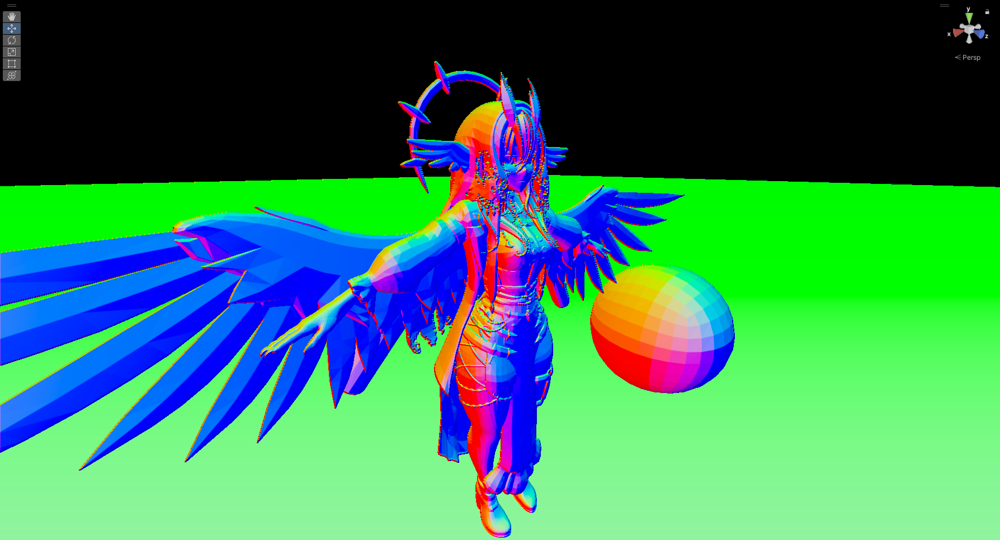
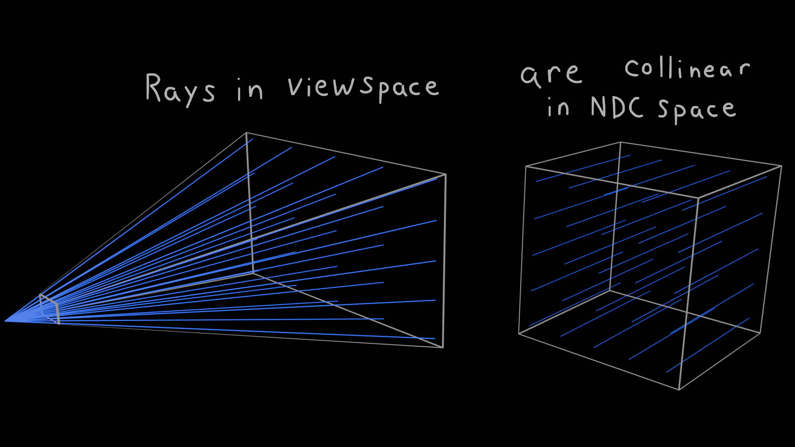
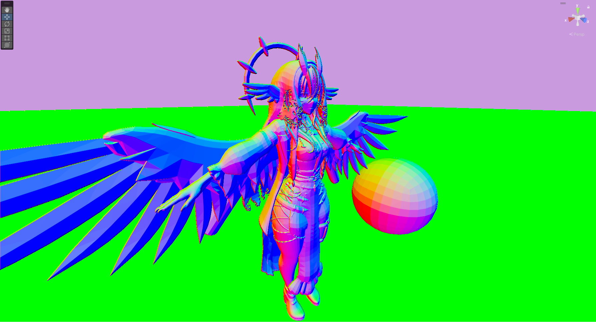
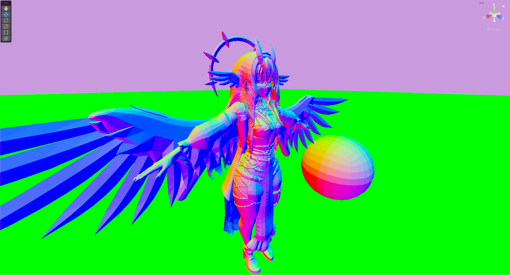
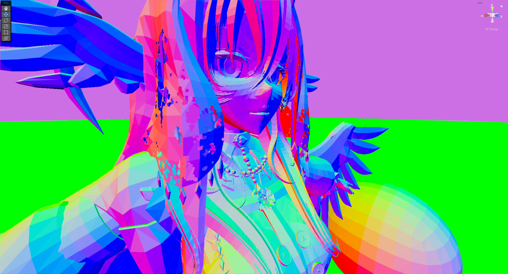
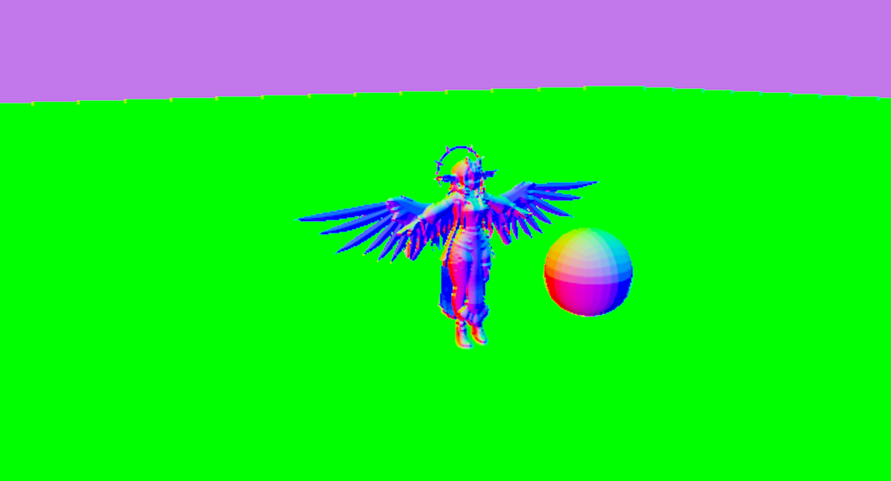

# Normal Reconstruction (My Best Attempt)

I'd like to preface this section with two things. First off, I'm currently job hunting, and I haven't had as much free time as usual, so this section is sadly not completed. Secondly, I'd love to introduce the following topics with the visuals I have in my head, but again, I don't have the time to finish the project, let alone have time to generate visuals for it.
Sorry it has to be this way, I'd rather push the things I've figured out so far instead of keepingh it in a random file on my computer, and never releasing it (maybe later I'll come back to this.) It's now 2:20am, I haven't proof read this shit, but it's good enough to post I guess.. Time to eat and get back to job hunting; If you wish to hire me or know someone who will, my DMs are definitely open ^w^

For a long long time I have been trying to find a way to reconstruct viewspace normals using nothing but the camera depth texture. The depth buffer stores a 0 to 1 value per pixel on your screen to determine how far a surface is from the cameras point of view, mainly for discarding occluded pixels.

## (Roughly) The Graphics Pipeline

The default pipeline (to my knowledge) is:
- Input Assembly: Decodes the vertex, index, and instance buffers into raw triangle mesh data.
- Vertex Stage: Lets you transform the assembled mesh attributes (vertex position, texture coordinates, all attributes from your mesh) into clip space, per vertex.
- Tessellation Stage:
	- Hull Stage: Lets you define control points to generate more geometry "patches" based on the primitives transformed by the vertex stage.
	- Tessellation Stage: A fixed pipeline that subdivides the patches using control points from the hull stage.
	- Domain Stage: Computes the final vertex positions from each tessellation patch.
- Geometry Stage: Same idea as the vertex stage, but you transform the entire primitive at once instead of transformations per vertex.
- Stream Output Stage: Seems to stream the geometry stage results back to the GPU/CPU buffers
- Rasterization Stage: Evaluates all primitives and topology from the previous stages. Clips vertices outside the view frustum, applies perspective division to `SV_`, and determines how attributes are interpolated. (unless you include modifiers like `noperspective` and `nointerpolation`)
- Pixel Stage: Typically known as the "fragment shader" stage, defines the pixel colour through `SV_Target`, and optionally other UAV sources like `SV_Depth`.
- Output Merger Stage: The final stage that merges the output of the pixel shader. The pixel shader outputs are blended using the BlendOp if the depth test and stencil test both pass.

You may read more here https://learn.microsoft.com/en-us/windows/win32/direct3d11/overviews-direct3d-11-graphics-pipeline

Believe it or not, the depth and stencil test are evaluated after the pixel shader stage by default. This is because the pixel shader can change the depth buffer which APIs assume the safest option, and do depth/stencil testing after everything. If you target shader model 5+, you can add the attribute [`[earlydepthstencil]`](https://learn.microsoft.com/en-us/windows/win32/direct3dhlsl/sm5-attributes-earlydepthstencil) and you may [read about it much more here.](https://therealmjp.github.io/posts/to-earlyz-or-not-to-earlyz/)

## Why Does That Matter?

Most fragment shaders don't use `SV_Depth`, `SV_DepthLessEqual`, `SV_DepthGreaterEqual`, and other methods to modify the depth buffer per pixel. The ones that *do* modify the depth per pixel don't really have any real method to interpolate the surface like smooth normals would, so for 99% of cases we'll assume the depth buffer will only ever contain flat shaded values (which is what you'd want there anyway.)

Therein lies our problem though.. if you want to reconstruct normals from viewspace, you lose the interpolation factors, meaning faces with smooth shading will always reconstruct looking like they're flat shaded because the interpolants aren't stored in depth.

**Because of this, it's mathematically impossible to get smooth normal reconstruction from the depth buffer alone, unless you're fine with extremely expensive methods, or more surface information.**

I'd love to be wrong on that claim, but I've been trying this shit for the better part of three years by now (due to VRChats limitiations) and that's been a constant even up to now.

## Method 1: Cross Product of Partial Derivatives

Most people, including I, have attempted to solve this problem in screenspace / view space since the depth buffer stores depth values per pixel on your *screen.* Good ol Ben Golus [has a gist shader for this](https://gist.github.com/bgolus/a07ed65602c009d5e2f753826e8078a0) and [this report goes over a decent method](https://atyuwen.github.io/posts/normal-reconstruction/) to reconstruct the normals.

The simplest method to reconstruct the viewspace normals utilizes the hardware functions `ddx` and `ddy`. Stopping to think about what a "normal" even is for this case, it's a vector perpendicular / "orthogonal" to the surface of your mesh.

Computing `ddx(ws_scenePos)` tells you how much the world space position changes if you move one pixel to the right, and `ddy(ws_scenePos)` tells you how much the position changes if you move one pixel up.

If we interpret `ddx(ws_scenePos)` as a tangent on the mesh, and `ddy(ws_scenePos)` as a bitangent respectively, we can compute the normal by taking the cross product of both.

```glsl
float3 normal = normalize(-cross(ddx_fine(ws_scenePos), ddy_fine(ws_scenePos)));
```

<p align="center">
    
</p>

This method is the cheapest I can think of while still giving results that can be used. (I'm sure theres a method for computing the central differences and replace ddx and ddy here, but I don't have high hopes in that being great.)

There are some problems with this method though.
- It looks blocky
- If the depth changes dramatically, you get very wrong normals

## Method 2: Viewspace Plane

Stepping back a bit, instead of computing the normal directly, it may be advantageous to compute the best-fit plane, *then* compute the normal from that.

To give ourselves some data to work with, we'll sample a 3x3 grid around our pixel coordinate to get nine depth values. Theres a good chance all samples are within texel cache enough times where its not as horrible, but we gotta do what we gotta do.

A plane can be defined in point-normal form.

```math
\Large Ax + By + C = z
```

We sample a 3x3 grid like so

```math
\Large
\begin{bmatrix}
	z_7 & z_8 & z_9 \\
	z_4 & z_5 & z_6 \\
	z_1 & z_2 & z_3
\end{bmatrix}
```
With $z_1$ at bottom left, $z_5$ as the pixel we're calculating, and so on.

The normal $(A,B,C)$ can be found through the over constrained linear system.

```math
\Large
\begin{bmatrix}
	-w & -h & 1 \\
	 0 & -h & 1 \\
	+w & -h & 1 \\
	-w &  0 & 1 \\
	 0 &  0 & 1 \\
	+w &  0 & 1 \\
	-w & +h & 1 \\
	 0 & +h & 1 \\
	+w & +h & 1
\end{bmatrix}
\begin{bmatrix}
	A \\
	B \\
	C
\end{bmatrix}
=
\begin{bmatrix}
	z_1 \\
	z_2 \\
	z_3 \\
	z_4 \\
	z_5 \\
	z_6 \\
	z_7 \\
	z_8 \\
	z_9
\end{bmatrix}
```

> [!NOTE]
> Technically this is *the worst* way to do this, since our coefficient matrix contains literally no sample data, thus this system solution is entirely invariant, but the solution with the z coordinates in the coefficient matrix instead of the constant vector resulted in solutions that went off my screen.

We now have the system

```math
\Large
	\mathbf{A}x = \mathbf{z}
```

Which we can compute the normal $x$ using the left pseudo inverse of $\mathbf{A}$

```math
\Large
\begin{gather*}
	\mathbf{A}^+ \mathbf{A}x = \mathbf{A}^+ \mathbf{z} \\
	x = \mathbf{A}^+\mathbf{z} = (\mathbf{A}^T \mathbf{A})^{-1} \mathbf{A}^T \mathbf{z} \\
\end{gather*}
```

```math
\Large

\mathbf{A}^+ =
\begin{bmatrix}
	-1/6w & 0 & 1/6w & -1/6w & 0 & 1/6w & -1/6w & 0 & 1/6w \\
	-1/6h & -1/6h & -1/6h & 0 & 0 & 0 & 1/6h & 1/6h & 1/6h \\
	1/9 & 1/9 & 1/9 & 1/9 & 1/9 & 1/9 & 1/9 & 1/9 & 1/9
\end{bmatrix}
```

Going through the computation gives us the following
```glsl
A = (-z1 + z3 - z4 + z6 - z7 + z9) / (6 * w)
B = (-z1 - z2 - z3 + z7 + z8 + z9) / (6 * h)
C = ( z1 + z2 + z3 + z4 + z5 + z6 + z7 + z8 + z9) / 9
```

If you rearrange these a bit, you'll find the directional gradient convolutions somewhat similar to a [sobel filter](https://en.wikipedia.org/wiki/Sobel_operator)

```math
\Large
\begin{aligned}
	A &= \frac{1}{6w}
	\begin{bmatrix}
		+1 & 0 & -1 \\
		+1 & 0 & -1 \\
		+1 & 0 & -1
	\end{bmatrix}
	\times
	\begin{bmatrix}
		z_7 & z_8 & z_9 \\
		z_4 & z_5 & z_6 \\
		z_1 & z_2 & z_3
	\end{bmatrix}
	\\
	B &= \frac{1}{6h}
	\begin{bmatrix}
		-1 & -1 & -1 \\
		0 & 0 & 0 \\
		+1 & +1 & +1
	\end{bmatrix}
	\times
	\begin{bmatrix}
		z_7 & z_8 & z_9 \\
		z_4 & z_5 & z_6 \\
		z_1 & z_2 & z_3
	\end{bmatrix}
	\\
	C &= \frac{1}{9}
	\begin{bmatrix}
		+1 & +1 & +1 \\
		+1 & +1 & +1 \\
		+1 & +1 & +1
	\end{bmatrix}
	\times
	\begin{bmatrix}
		z_7 & z_8 & z_9 \\
		z_4 & z_5 & z_6 \\
		z_1 & z_2 & z_3
	\end{bmatrix}
\end{aligned}
```

This gives you a pretty decent normal reconstruction if you multiply `A,B` by the resolution of the screen, and I've posted this a long time ago [in the dumping grounds.](./DumpingGrounds.md#reconstruct-normals-from-depth-texture)

<p align="center">
    
</p>

# Method 3: NDC Reconstruction

Before I go into this section, I'd like to state I tried solving the ordinary least squares problem above with a singular value decomposition, and with the samples in the design matrix, but let's just say its not at all worth it, and the precision needed does not work well.

At some point I was sitting in the shower thinking about the fact that the solution above causes upward bias in the direction due to the way the system is solved. I realized the depth buffer values are derived in clip space, and thus the range is from the near plane to the far plane. This is the reason you'll see stuff like this

```glsl
float3 camFwd = -UNITY_MATRIX_I_V._m02_m12_m22;
float3 rayDir = normalize(i.rayPos);
rayDir /= dot(rayDir, camFwd);
```

This projects the unit length `rayDir` towards a plane thats one unit in front of the camera (which we do because the near plane is a *plane*.) Recalling this, I stopped thinking about trying to reconstruct the normals in viewspace and instead went for NDC space. This space has so much importance to many things now that I think about it; enough for me to actually make a diagram for it.

<p align="center">
    
</p>

NDC coordinates are produced by applying perspective division of a clip space coordinate. $(x/w, y/w, z/w, 1)$. This implies a ray in viewspace is aligned with the Z-axis in NDC space.
```math
\Large
\begin{gather*}
\mathbf{c} + \lambda \mathbf{v} \propto [x, y, t] \\
\lambda \in [\text{near}, \text{far}] \quad t \in [-1, 1]
\end{gather*}
```

Reconstructing normals within NDC space has the following advantages.
- The depth buffer stores values ranging from `0` to `1`, representing the `near` to `far` range.
- The range of `x` and `y` are from `-1` to `1` no matter what resolution and aspect your screen is.
- The range of `z` is also from `-1` to `1` (for OpenGL, which we assume for future reasons) no matter what your cameras `near` plane and `far` plane distances are.
- Solving systems for NDC is the most numerically stable compared to any other space.
- NDC coordinates can easily transform into worldspace coordinates thanks to linearity in the projection matrix.
- The rays around a pixel don't require computing new ray directions since each ray is collinear along the Z-axis.
- LinearEyeDepth isn't required!


We can define a plane for this problem as such

```math
\Large A(x + x_0) + B(y + y_0) = z
```

Let $A$, $B$ represent the planes normal components, $(x, y)$ are coordinate variables, and $(x_0, y_0)$ to be the pixel coordinate in NDC space. The $(x_0, y_0)$ offset terms can be factored out into a bias term, meaning we can solve for $(A, B)$ without accounting for the pixels coordinate.

```math
\Large
\begin{aligned}
	A(x + x_0) + B(y + y_0) &= z \\
	A x + A x_0 + B y + B y_0 &= z \\
	Ax + By + (A x_0 + B y_0) &= z \\
	Ax + By + C &= z
\end{aligned}
```

We'll deal with the offset term later, for now we can go forward with solving the $A$, $B$ terms specifically. We define each depth buffer sample the same way we did in [method 2.](#method-2-viewspace-plane) Technically the correct way to remove the bias in $z_1$ through $z_9$ would be to subtract their mean, but I find it makes the most sense to subtract the current pixels depth ($z_5$) from the surrounding eight depth values. This also has the added benefit of making $\large A(0) + B(0) = z_5 - z_5$ (ignoring +C for the moment)

The formula of our NDC plane is as such

```math
\Large A (i \Delta_x) + B(j \Delta_y) = z_{ij} - z_5
```

Which we can sum the errors as a function of $A$ and $B$

```math
\Large S(A, B) = \sum_{i,j}{\left[(z_{ij} - z_5) - A (i \Delta_x) - B (j \Delta_y) \right]^2}
```

Taking the partial derivatives of $S$ with respect to $A$ and $B$

```math
\Large
\begin{aligned}
	\frac{\partial S}{\partial A} &= A (12 \Delta_x^2) + 2 \Delta_x (z_1 - z_3 + z_4 - z_6 + z_7 - z_9) \\[8pt]
	\frac{\partial S}{\partial B} &= B (12 \Delta_y^2) + 2 \Delta_y (z_1 + z_2 + z_3 - z_7 - z_8 - z_9)
\end{aligned}
```

Then solving for $\large \frac{\partial S}{\partial A}, \frac{\partial S}{\partial B} = 0$

```math
\Large
	A = \frac{-z_1 + z_3 - z_4 + z_6 - z_7 + z_9}{6 \Delta_x} \quad
	B = \frac{-z_1 - z_2 - z_3 + z_7 + z_8 + z_9}{6 \Delta_y}
```

Hmm.. looking a little like [method 2..](#method-2-viewspace-plane) in fact for the most part it is! except this time I've got a different way to compute $C$ and go from NDC space to world space :3

Looking back a few steps we had the plane, which we can factor into the typical point-normal plane form.

```math
\Large
\begin{aligned}
	Ax + By + C &= z \\
	Ax + By + (-1)z + C &= 0
\end{aligned}
```

Which means the normal vector of this system is $\large (A, B, -1)$ but we actually want Z to be positive, so we flip the signature of each element, giving us $\large (-A, -B, 1)$ (which we'll ironically normalize to a unit length vector)

```math
\Large
\begin{aligned}
\mathbf{N} = \frac{(-A, -B, 1)}{\sqrt{(-A)^2 + (-B)^2 + (1)^2}} &= \frac{(-A, -B, 1)}{\sqrt{1 + A^2 + B^2}} \\
-Ax -By + z - C &= 0
\end{aligned}
```

Without perspective division, the transformation of a worldspace position to NDC is linear up to scale (A x_world is "proportional to" / "equal up to scale" x_ndc) the perspective division is the operation that collapses all lines down to points. Think of the homogeneous line being a viewing ray, i.e. the set of all 3D points that land on a pixel coordinate, which after perspective division results in the same pixel coordinate.

```math
\Large \mathbf{x}_{\text{ndc}} \propto \mathbf{A} \mathbf{x}_{\text{world}} \\
```

If you *don't* apply the perspective division and keep it homogeneous, we can substitute the proportionality from above into a line equation in NDC space. (x dot normal = 0 is true when x is within the span of the plane.)

```math
\Large
\begin{aligned}
\mathbf{l}^T_{\text{ndc}} \mathbf{x}_{\text{ndc}} &= 0 \\
\mathbf{l}^T_{\text{ndc}} (\mathbf{A} \mathbf{x}_{\text{world}}) &= 0 \\
\left(\mathbf{A}^T \mathbf{l}_{\text{ndc}}\right)^T \mathbf{x}_{\text{world}} &= 0 \\
\end{aligned}
```

Now we have the line in world space

```math
\Large \mathbf{l}_{\text{world}} = \mathbf{A}^T \mathbf{l}_{\text{ndc}} = \left(\mathbf{VP}\right)^T \mathbf{l}_{\text{ndc}}
```

finally not ignoring the bias of the line since we need it as the scale component of $\mathbf{l}_{\text{ndc}}$

```math
\Large
	C = \mathbf{N}_x (2 x_0 - 1) + \mathbf{N}_y (2 y_0 - 1) + \mathbf{N}_z \bar{z}
```

The `2 x - 1` and `2 y - 1` parts transform the screen UV into NDC space, since screen pos stuff is from 0 to 1, we just linear map it to -1 to +1. The $\large \bar{z}$ is technically the mean of $z_1$ through $z_9$, but for this case we do the same middle depth value thing, so $\large \bar{z} = z_5$

I really wish I had more time to lay this all out, and I'm sure some of this is underpresented, especially for such a complex topic, but the second I have a stable position to do so, I'll revise this all and make it better, I promise! :purple_heart:

Either way, here's the result so far

<p align="center">
    
</p>

```glsl
float3 getNormalNDC(float2 screenPos)
{
	float2 ts = 1 / _ScreenParams.xy;
	float2 ndxy = float2(2, 2*_ProjectionParams.x) * ts;
	float dx = ndxy.x, dy = ndxy.y;

	float z1 = SAMPLE_DEPTH_TEXTURE(_CameraDepthTexture, screenPos + float2(-1,-1) * ts);
	float z2 = SAMPLE_DEPTH_TEXTURE(_CameraDepthTexture, screenPos + float2( 0,-1) * ts);
	float z3 = SAMPLE_DEPTH_TEXTURE(_CameraDepthTexture, screenPos + float2(+1,-1) * ts);
	float z4 = SAMPLE_DEPTH_TEXTURE(_CameraDepthTexture, screenPos + float2(-1, 0) * ts);
	float z5 = SAMPLE_DEPTH_TEXTURE(_CameraDepthTexture, screenPos + float2( 0, 0) * ts);
	float z6 = SAMPLE_DEPTH_TEXTURE(_CameraDepthTexture, screenPos + float2(+1, 0) * ts);
	float z7 = SAMPLE_DEPTH_TEXTURE(_CameraDepthTexture, screenPos + float2(-1,+1) * ts);
	float z8 = SAMPLE_DEPTH_TEXTURE(_CameraDepthTexture, screenPos + float2( 0,+1) * ts);
	float z9 = SAMPLE_DEPTH_TEXTURE(_CameraDepthTexture, screenPos + float2(+1,+1) * ts);

	float nrm_a = (-z1+z3-z4+z6-z7+z9) / (6.0 * dx);
	float nrm_b = (-z1-z2-z3+z7+z8+z9) / (6.0 * dy);

	float3 nrm = normalize(float3(-nrm_a, -nrm_b, 1));

	float x0 = screenPos.x * 2 - 1;
	float y0 = (screenPos.y * 2 - 1) * _ProjectionParams.x;
	float D = -(nrm.x * x0 + nrm.y * y0 + nrm.z * z5);

	float4 lNDC = float4(nrm, D);
	float4 wsL = mul(transpose(UNITY_MATRIX_VP), lNDC);
	return normalize(wsL.xyz);
}
```

The only problem here is we still have the normals being.. rounded? when there are holes. This is because finding a plane to each depth value gives weight to each depth sample entirely equally.

## Method 3.1: Weighted NDC Reconstruction

We can step back all the way to the sum of square differences and give a weight value to each depth sample

```math
\Large S(A, B) = \sum_{i,j}{ w_{ij} \left[(z_{ij} - z_5) - A (i \Delta_x) - B (j \Delta_y) \right]^2}
```

Taking the partial derivatives of this one gives a much less elegant result

```math
\Large
\begin{aligned}
	\frac{\partial S}{\partial A} &=
	A \left(2 \Delta_x^2 (w_1 + w_3 + w_4 + w_6 + w_7 + w_9)\right) \\
	&+ B \left(2 \Delta_x \Delta_y (w_1 - w_3 - w_7 + w_9)\right) \\
	&+ 2 \Delta_x (w_1 z_1 - w_3 z_3 + w_4 z_4 - w_6 z_6 + w_7 z_7 - w_9 z_9 \\
	&- z_5 (w_1 - w_3 + w_4 - w_6 + w_7 - w_9)) \\
	\frac{\partial S}{\partial B} &=
	A \left(2 \Delta_x \Delta_y (w_1 - w_3 - w_7 + w_9)\right) \\
	&+ B\left(2 \Delta_y^2 (w_1 + w_2 + w_3 + w_7 + w_8 + w_9)\right) \\
	&+ 2 \Delta_y (w_1 z_1 + w_2 z_2 + w_3 z_3 - w_7 z_7 - w_8 z_8 - w_9 z_9 \\
	&- z_5(w_1 + w_2 + w_3 - w_7 - w_8 - w_9))
\end{aligned}
```

since we're solving for A and B, we can rearrange these two equations into a linear system.

```math
\Large
\begin{aligned}
	A x_0 + B x_1 &= -y_1 \\
	A x_2 + B x_3 &= -y_2 \\
	\begin{bmatrix}
		x_0 & x_1 \\
		x_2 & x_3
	\end{bmatrix}
	\begin{bmatrix}
		A \\
		B
	\end{bmatrix}
	&=
	\begin{bmatrix}
		-y_1 \\
		-y_2
	\end{bmatrix}
\end{aligned}
```

As for the weights, I haven't had enough time to find a good solution for them, but I've found the best so far to be

```math
\Large w_i = \exp\left(\sigma(z_i - z_5)^2\right)
```

and solving the system with this weight gives you this


```glsl
float3 getWeightedNormalNDC(float2 screenPos)
{
	float2 ts = 1 / _ScreenParams.xy;
	float2 ndxy = float2(2, 2*_ProjectionParams.x) * ts;
	float dx = ndxy.x, dy = ndxy.y;

	float z1 = SAMPLE_DEPTH_TEXTURE(_CameraDepthTexture, screenPos + float2(-1,-1) * ts);
	float z2 = SAMPLE_DEPTH_TEXTURE(_CameraDepthTexture, screenPos + float2( 0,-1) * ts);
	float z3 = SAMPLE_DEPTH_TEXTURE(_CameraDepthTexture, screenPos + float2(+1,-1) * ts);
	float z4 = SAMPLE_DEPTH_TEXTURE(_CameraDepthTexture, screenPos + float2(-1, 0) * ts);
	float z5 = SAMPLE_DEPTH_TEXTURE(_CameraDepthTexture, screenPos + float2( 0, 0) * ts);
	float z6 = SAMPLE_DEPTH_TEXTURE(_CameraDepthTexture, screenPos + float2(+1, 0) * ts);
	float z7 = SAMPLE_DEPTH_TEXTURE(_CameraDepthTexture, screenPos + float2(-1,+1) * ts);
	float z8 = SAMPLE_DEPTH_TEXTURE(_CameraDepthTexture, screenPos + float2( 0,+1) * ts);
	float z9 = SAMPLE_DEPTH_TEXTURE(_CameraDepthTexture, screenPos + float2(+1,+1) * ts);

	float rad = 0.0009; // havent found a better solution yet
	float sigma = 1 / (rad*rad);

	#define expw(n) float w##n = max(exp2(-pow(z##n - z5, 2) * sigma), 1e-6)
	expw(1); expw(2); expw(3);
	expw(4);          expw(6);
	expw(7); expw(8); expw(9);
	#undef expw

	float Mxx = dx * dx * (w1+w3+w4+w6+w7+w9);
	float Myy = dy * dy * (w1+w2+w3+w7+w8+w9);
	float Mxy = dx * dy * (w1-w3-w7+w9);

	float Bx = -dx * (w1*z1 - w3*z3 + w4*z4 - w6*z6 + w7*z7 - w9*z9 + z5 * (-w1+w3-w4+w6-w7+w9));
	float By = -dy * (w1*z1 + w2*z2 + w3*z3 - w7*z7 - w8*z8 - w9*z9 + z5 * (-w1-w2-w3+w7+w8+w9));

	float IdetM = 1 / (Mxx * Myy - Mxy * Mxy);
	float nrm_a = (Myy * Bx - Mxy * By) * IdetM;
	float nrm_b = (Mxx * By - Mxy * Bx) * IdetM;

	float3 nrm = normalize(float3(-nrm_a, -nrm_b, 1));

	float x0 = screenPos.x * 2 - 1;
	float y0 = (screenPos.y * 2 - 1) * _ProjectionParams.x;
	float D = -(nrm.x * x0 + nrm.y * y0 + nrm.z * z5);

	float4 lNDC = float4(nrm, D);
	float4 wsL = mul(transpose(UNITY_MATRIX_VP), lNDC);
	return normalize(wsL.xyz);
}
```

This method gives smooth normals as you move further away, and sharper normals as you get close.

<p align="center">
    
</p>

<p align="center">
    
</p>

<p align="center">
    
</p>

I haven't had the time to reduce the amount of registers this stuff uses, but by far this is the best normal reconstruction method I have on hand. I really really really *really* wish I had more time, but do with this what you will. Thank you for all the support.

I have [the shader with all the methods here](../_InternalAssets/normal_reconstruction/shaders/ReconstructionMethods.shader), just put it on a Unity default cube.