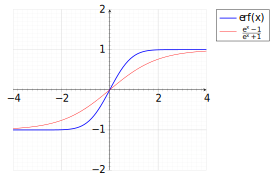

# Error Function Approximation

Through integration, the error function $\mathrm{erf}(x)$ comes in handy when integrating annoying exponentials.

```math
\mathrm{erf}(z) = \frac{2}{\sqrt{\pi}}\int_0^z{e^{-t^2}\:dt}
```

Very useful function, but hlsl doesn't provide an intrinsic for it. So I figured I'd do exactly that!

## Derivation

I started with the [Logistic function](https://en.wikipedia.org/wiki/Logistic_function) as a base, because it's definition is simple and should generate somewhat efficient shader assembly.

```math
f(x) = \frac{1}{1 + e^{-x}}
```

I then did some work to convert the range from $[0, 1]$ to $[-1, 1]$

```math
\begin{aligned}
	f(x) &= \left(\frac{1}{1+e^{-x}}\right)2 - 1 \\
	&= \frac{2 - \left(1 + e^{-x}\right)}{1 + e^{-x}} \\
	&= \frac{1 - e^{-x}}{1 + e^{-x}}
	= \frac{1 - \frac{1}{e^x}}{1 + \frac{1}{e^x}}
	= \frac{ \frac{e^x-1}{\cancel{e^x}} }{ \frac{e^x+1}{\cancel{e^x}} } \\
	&= \frac{e^x - 1}{e^x + 1} \text{ or } \tanh\left(\frac{x}{2}\right)
\end{aligned}
```

<p align="center">
	
</p>

This function looks like it could match the error function with a bit of tuning!
I added a term $w$ as a scalar to $x$, which we can find a good $w$ term to approximate the error function.

```math
	\frac{e^{\textcolor{blue}{w}x} - 1}{e^{\textcolor{blue}{w}x} + 1}
```

To figure out the best fitting $w$ term, I defined $w$ as a third degree polynomial, and used Mathematica to numerically optimize the coefficients through *difference of squares*.

```math
	\min_{a,b,c,d \in \mathbb{R}}\int_{-4}^{4}{\left(
		\frac{e^{wx}-1}{e^{wx}+1} - \mathrm{erf}(x)
	\right)^2\:dx},\quad \text{where } w = a x^3 + b x^2 + c x + d
```

*I'm unsure how to denote minimizing with variables notationally. I wouldn't be surprised if the min above is weirdly formatted.*

```mathematica
f[x_, a_, b_, c_, d_] := (Exp[a x^3 + b x^2 + c x + d] - 1) / (Exp[a x^3 + b x^2 + c x + d] + 1);

NMinimize[
	NIntegrate[ (f[x, a, b, c, d] - Erf[x])^2, {x, -4, 4}],
	-10 <= {a, b, c, d} <= 10,
	{a, b, c, d}
]
> {1.9055202778778616`*^-7,{a->0.20060342258513855`,b->6.6130126555178515`*^-9,c->2.258650133073076`,d->-8.846897586292703`*^-9}}
```

I tweaked the expression since the values of $b$ and $d$ seem to vanish to almost zero.

```math
	w = ax^3 + \cancel{bx^2} + cx + \cancel{d} \to ax^3 + cx
```

```mathematica
f[x_, a_, b_] := (Exp[a x^3 + b x] - 1) / (Exp[a x^3 + b x] + 1);

NMinimize[
	NIntegrate[ (f[x, a, b] - Erf[x])^2, {x, -4, 4}],
	-4 <= {a, b} <= 4, {a, b}
]
> {1.905520277494207`*^-7,{a->0.2006033923313427`,b->2.258650166982141`}}
```

Which gives us the final formula, statistics, and implementation.

```math
\mathrm{erf}(x) \approx \frac{e^{wx}-1}{e^{wx}+1},\quad w = 0.2006033923313427x^3 + 2.258650166982141x
```

```mathematica
eval[x_] := f[x, 0.2006033923313427, 2.258650166982141] - Erf[x];

FindMinimum[eval[x], {x, 0}]
FindMaximum[eval[x], {x, 0}]
Mean[Table[eval[x], {x, -4, 4, 1/1000}]]
Median[Table[eval[x], {x, -4, 4, 1/1000}]]
> {-0.0003216649658274173`,{x->-1.857505697450493`}}
  {0.0003216649658274173`,{x->1.857505431231737`}}
  4.42299198974214`*^-19
  0.`
```

<p align="center">
	
</p>

```hlsl
float erf(float x)
{
    float w = x*(0.2006033923313427*x*x + 2.258650166982141);
    return (exp(w) - 1.0) / (exp(w) + 1.0);
}
```