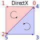
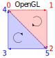

# UnityCRT

A custom implementation of the `UnityCustomRenderTexture.cginc` file. More performant, flexible, (hopefully) easier to use, and small enough to fit on a floppy drive. Also comes with this readme as an extra work study to how I got here!

## Differences

Let's first begin with a standard ass CRT shader.

```hlsl
Shader "CustomRenderTexture"
{
    Properties
    {
        _MainTex("Input Texture", 2D) = "white" {}
        _Color("Color", Color) = (1,1,1,1)
    }
    SubShader
    {
        Tags { "RenderType"="Opaque" }

        Blend One Zero
        //Optional
        Lighting Off
        ZTest Always
        ZWrite Off

        Pass
        {
            Name "CustomRenderTexture"

            CGPROGRAM
            #include "UnityCustomRenderTexture.cginc"
            #include "UnityCG.cginc"

            #pragma vertex CustomRenderTextureVertexShader
            #pragma fragment frag

            sampler2D _MainTex;
            half4 _Color;

            float4 frag(v2f_customrendertexture i) : SV_Target
            {
                float2 uv = i.localTexcoord.xy;
                return tex2D(_MainTex, uv) * _Color;
            }
            ENDCG
        }
    }
}
```
Above is the CRT shader template I use every time. *Downloading this thing from discord DMs has probably increased my carbon footprint, but it works.* It's a very simple texture sampler, including the obligatory multiplied color as the RGB cherry on top. All around pretty simple to get going once you have it all typed out. If you're curious and don't trust anything, you might be wondering (or already know) what goes on behind the doors of `CustomRenderTextureVertexShader` and friends? Surely it'll be a valentines day gift and a half *right*?.

### 78 steps, 47 math, 2 branches, 8 temp registers, and a partridge in a pear tree

Because the `UnityCustomRende`- ugh.
Because the damn CGINC handles 2D, 3D, and Cubemap CRTs without using keywords to remove unused code, you get a marvelous GPU warp stress test and the gift of -1 fps in a VRChat world.

Today, the "Compile and show code" button will show us the way towards our destiny of setting up the two triangles of a quad! (thats like six whole vertices ya' know)

<details>
<summary> Output of the D3D11 vertex shader decompiled code </summary>
<br>

```hlsl

Shader Disassembly:
//
// Generated by Microsoft (R) D3D Shader Disassembler
//
//
// Input signature:
//
// Name                 Index   Mask Register SysValue  Format   Used
// -------------------- ----- ------ -------- -------- ------- ------
// SV_VertexID              0   x           0   VERTID    uint   x
//
//
// Output signature:
//
// Name                 Index   Mask Register SysValue  Format   Used
// -------------------- ----- ------ -------- -------- ------- ------
// SV_POSITION              0   xyzw        0      POS   float   xyzw
// TEXCOORD                 0   xyz         1     NONE   float   xyz
// TEXCOORD                 1   xyz         2     NONE   float   xyz
// TEXCOORD                 2   x           3     NONE    uint   x
// TEXCOORD                 3   xyz         4     NONE   float   xyz
//
      vs_4_0
      dcl_immediateConstantBuffer { { -1.000000, 1.000000, 0, 0},
                              { -1.000000, -1.000000, 0, 1.000000},
                              { 1.000000, -1.000000, 1.000000, 1.000000},
                              { 1.000000, 1.000000, 1.000000, 0},
                              { -1.000000, 1.000000, 0, 0},
                              { 1.000000, -1.000000, 1.000000, 1.000000} }
      dcl_constantbuffer CB0[52], dynamicIndexed
      dcl_input_sgv v0.x, vertex_id
      dcl_output_siv o0.xyzw, position
      dcl_output o1.xyz
      dcl_output o2.xyz
      dcl_output o3.x
      dcl_output o4.xyz
      dcl_temps 8
   0: udiv r0.x, r1.x, v0.x, l(6)
   1: and r0.x, r0.x, l(15)
   2: mul r0.y, l(0.017453), cb0[r0.x + 18].w
   3: lt r0.zw, l(0.000000, 0.000000, 0.000000, 0.000000), cb0[50].xxxz
   4: div r1.yz, cb0[r0.x + 2].xxyx, cb0[51].xxyx
   5: div r2.yz, cb0[r0.x + 18].xxyx, cb0[51].xxyx
   6: mul r3.x, cb0[51].z, cb0[r0.x + 2].z
   7: mul r3.w, cb0[51].z, cb0[r0.x + 18].z
   8: movc r1.yz, r0.zzzz, r1.yyzy, cb0[r0.x + 2].xxyx
   9: mov r2.x, cb0[r0.x + 2].z
  10: mov r2.w, cb0[r0.x + 18].z
  11: mov r3.yz, cb0[r0.x + 18].xxyx
  12: movc r2.xyzw, r0.zzzz, r2.xyzw, r3.xyzw
  13: mad r1.yz, r1.yyzy, l(0.000000, 2.000000, 2.000000, 0.000000), l(0.000000, -1.000000, -1.000000, 0.000000)
  14: mul r2.yz, r2.zzyz, icb[r1.x + 0].yyxy
  15: sincos r3.x, r4.x, r0.y
  16: mul r0.yz, r2.yyzy, r3.xxxx
  17: mad r0.y, r2.z, r4.x, -r0.y
  18: mad r0.z, r2.y, r4.x, r0.z
  19: add r3.xy, r1.yzyy, r0.yzyy
  20: mad r0.y, -r2.w, l(0.500000), r2.x
  21: ftoi r0.z, r0.y
  22: ftoi r1.y, r2.w
  23: iadd r0.z, r0.z, r1.y
  24: round_z r0.y, r0.y
  25: lt r0.y, cb0[51].w, r0.y
  26: itof r0.z, r0.z
  27: ge r0.z, cb0[51].w, r0.z
  28: or r0.y, r0.z, r0.y
  29: movc r0.yz, r0.yyyy, l(0,1000.000000,1000.000000,0), r3.xxyx
  30: movc r0.yz, r0.wwww, r0.yyzy, r3.xxyx
  31: mad r2.xy, r0.yzyy, l(0.500000, 0.500000, 0.000000, 0.000000), l(0.500000, 0.500000, 0.000000, 0.000000)
  32: add r2.z, -r2.y, l(1.000000)
  33: mad r3.xy, r2.xzxx, l(2.000000, 2.000000, 0.000000, 0.000000), l(-1.000000, -1.000000, 0.000000, 0.000000)
  34: eq r0.w, cb0[51].w, l(0.000000)
  35: if_nz r0.w
  36:   mov r4.yz, -r3.yyxy
  37:   mov r4.x, l(1.000000)
  38:   dp3 r0.w, r4.xyzx, r4.xyzx
  39:   rsq r0.w, r0.w
  40:   mul o4.xyz, r0.wwww, r4.xyzx
  41: else
  42:   mov r3.z, l(-1.000000)
  43:   mov r3.w, -r3.y
  44:   mul r1.yzw, r3.xxzy, l(0.000000, 1.000000, 1.000000, -1.000000)
  45:   dp3 r0.w, r3.xzwx, r1.yzwy
  46:   rsq r0.w, r0.w
  47:   mul r4.xyz, r0.wwww, r1.zwyz
  48:   mov r5.xz, r3.xxyx
  49:   mov r5.y, l(1.000000)
  50:   dp3 r0.w, r5.xyzx, r5.xyzx
  51:   rsq r0.w, r0.w
  52:   mul r6.xyz, r0.wwww, r5.xyzx
  53:   dp3 r0.w, r1.yzwy, r1.yzwy
  54:   rsq r0.w, r0.w
  55:   mul r1.yzw, r0.wwww, r1.yyzw
  56:   eq r7.xyzw, cb0[51].wwww, l(1.000000, 2.000000, 3.000000, 4.000000)
  57:   mov r5.w, -r3.y
  58:   dp3 r0.w, r5.xywx, r5.xywx
  59:   rsq r0.w, r0.w
  60:   mul r5.xyz, r0.wwww, r5.xwyx
  61:   mul r3.xyz, r3.xwzx, l(-1.000000, 1.000000, 1.000000, 0.000000)
  62:   dp3 r0.w, r3.xyzx, r3.xyzx
  63:   rsq r0.w, r0.w
  64:   mul r3.xyz, r0.wwww, r3.xyzx
  65:   movc r3.xyz, r7.wwww, r5.xyzx, r3.xyzx
  66:   movc r1.yzw, r7.zzzz, r1.yyzw, r3.xxyz
  67:   movc r1.yzw, r7.yyyy, r6.xxyz, r1.yyzw
  68:   movc o4.xyz, r7.xxxx, r4.xyzx, r1.yzwy
  69: endif
  70: mov o0.xy, r0.yzyy
  71: mov o0.zw, l(0,0,1.000000,1.000000)
  72: mov o1.xy, icb[r1.x + 0].zwzz
  73: mov o1.z, cb0[50].y
  74: mov r2.w, cb0[50].y
  75: mov o2.xyz, r2.xzwx
  76: mov o3.x, cb0[r0.x + 34].x
  77: ret
// Approximately 0 instruction slots used
```

<h4 align="center" width="100%">
    ..... wtf why?
</h4>

</details>
<br>

Before I go into a much larger rant than needed, it's bad. For 99% of custom render textures, the vertex part of the cginc is almost as painful as typing `CustomRenderTextureVertexShader` for the 10000th time. I'm sympathetic of the situation though; experience tells me this file was definitely a group drudging effort very early on. I'd say after the `git merge` command worked successfully, everyone was likely swift in forgetting about it while they worked on much more pressing matters. Sadly, assets within VRChat use CRTs like Aladins one-stop carpet shop towards the next best implementation of a wacky real time lighting system.

Don't get me wrong here, custom render textures are *extremely useful* for solving a lot of problems, but their versatility often adds another link to the double buffered, circular dependency chaos chain of CRTs. I love the concept of putting a shader on a quad that blits to a readable texture as much as the next guy avoiding linear algebra like the plague, but they're used often enough where surely there's a better way to do this?

## I bring you: Fast 2D CRTs

After admittedly two days worth of work and project structure, I finally got around to making a CRT include that does 2D CRTs, and does it well.

Let's write the same shader as before but using my [CRTStandard2D.cginc](./shaders/CRTStandard2D.cginc) file.

```hlsl
Shader "CustomRenderTexture"
{
    Properties
    {
        _MainTex("Input Texture", 2D) = "white" {}
        _Color("Color", Color) = (1,1,1,1)
    }
    SubShader
    {
        // Skybox is used to reliably display the material preview correctly
        Tags { "RenderType"="Opaque" "PreviewType"="Skybox" }

        Blend One Zero
        //Optional
        Lighting Off
        ZTest Always
        ZWrite Off

        Pass
        {
            Name "CustomRenderTexture"

            CGPROGRAM
            #include "CRTStandard2D.cginc"
            #include "UnityCG.cginc"

            #pragma vertex crt_vert
            #pragma fragment frag

            sampler2D _MainTex;
            half4 _Color;

            float4 frag(crt_v2f i) : SV_Target
            {
                float2 uv = i.crt_uv.xy;
                return tex2D(_MainTex, uv) * _Color;
            }
            ENDCG
        }
    }
}
```

Not much has changed up front because just like the original, the real tea set is in the back of the kitchen, three floors away from this one.

## What's changed?

- `_CustomRenderTextureWidth` was the width of the CRT in pixels, now it's `CRT_WIDTH`
- `_CustomRenderTextureHeight` was the height of the CRT in pixels, now it's `CRT_HEIGHT`
- `CustomRenderTextureVertexShader` was the vertex pragma to target, now it's `crt_vert`
- `v2f_customrendertexture` was the Vertex -> Fragment struct, now it's `crt_v2f`
- `localTexcoord.xy` was the UV coordinates based on the `Update Zone Space` for normalized/pixel space, now
  - normalized UV coordinates are `crt_uv.xy`
  - pixel UV coordinates are `crt_uv.zw`
- `InitCustomRenderTextureVertexShader` was the initialization function for vertex shaders, now it's `CRT_INITIALIZE_OUTPUT` in vertex.
- The material preview is much more likely to display the preview instead of the envelope shape. Add `"PreviewType"="Skybox"` to your `Tags`
- Don't know if this was problematic before, but this works with OpenGL, DirectX, Vulkan and probably other graphics APIs.
- No branching, no expensive instructions, technically customizable, extremely fast, and only one (manditory) `mov` instruction!

And the main course:

### 6 steps, 5 math, 0 branches, 1 temp register

<details>
<summary> Output of the D3D11 vertex shader decompiled code </summary>

```hlsl
Shader Disassembly:
//
// Generated by Microsoft (R) D3D Shader Disassembler
//
//
// Input signature:
//
// Name                 Index   Mask Register SysValue  Format   Used
// -------------------- ----- ------ -------- -------- ------- ------
// SV_VertexID              0   x           0   VERTID    uint   x
//
//
// Output signature:
//
// Name                 Index   Mask Register SysValue  Format   Used
// -------------------- ----- ------ -------- -------- ------- ------
// SV_POSITION              0   xyzw        0      POS   float   xyzw
// TEXCOORD                 0   xyzw        1     NONE   float   xyzw
//
      vs_4_0
      dcl_constantbuffer CB0[1], immediateIndexed
      dcl_input_sgv v0.x, vertex_id
      dcl_output_siv o0.xyzw, position
      dcl_output o1.xyzw
      dcl_temps 1
   0: ushr r0.xyz, l(38, 44, 19, 0), v0.x
   1: imad r0.xyz, l(0x80000000, 0x80000000, 0x80000000, 0), r0.xyzx, l(0x3f800000, 0x3f800000, 0x3f800000, 0)
   2: mad o0.xyzw, r0.xyxy, l(1.000000, 1.000000, 0.000000, 0.000000), l(0.000000, 0.000000, 0.000000, 1.000000)
   3: mad r0.xy, r0.xzxx, l(0.500000, 0.500000, 0.000000, 0.000000), l(0.500000, 0.500000, 0.000000, 0.000000)
   4: mul o1.zw, r0.xxxy, cb0[0].xxxy
   5: mov o1.xy, r0.xyxx
   6: ret
// Approximately 0 instruction slots used
```

</details>

## The Raw CGINC

If this is the end of the road for your stay, I wish you the best of luck on your shader endeavours.
I have some [examples in the same directory you'll find the cginc file itself](./shaders).

```hlsl
// A heavily stripped down version of the UnityCustomRenderTexture.cginc by OwenTheProgrammer
#ifndef CRT_STANDARD_2D_INCLUDED
#define CRT_STANDARD_2D_INCLUDED

float4 _CustomRenderTextureInfo;

#define CRT_WIDTH       _CustomRenderTextureInfo.x
#define CRT_HEIGHT      _CustomRenderTextureInfo.y
#define CRT_RESOLUTION  _CustomRenderTextureInfo.xy

#define CRT_INPUT_ARGS  uint vid : SV_VertexID
#define CRT_V2F_ARGS	float4 vertex : SV_POSITION; float4 crt_uv : TEXCOORD0;

struct crt_v2f { CRT_V2F_ARGS };

inline float4 _CRT_COMPUTE_VT(CRT_INPUT_ARGS)
{
    #if UNITY_UV_STARTS_AT_TOP
        return asfloat((127<<23) + (1<<31) * (uint4(38,44,38,19) >> vid)); // DirectX
    #else
        return asfloat((127<<23) + (1<<31) * (uint4(25,44,25,44) >> vid)); // OpenGL
    #endif
}

#define _CRT_VT_VPOS(coords) coords.xyxy * float4(1,1,0,0) + float4(0,0,0,1)
#define _CRT_VT_UV(coords) coords.zwzw * 0.5 + 0.5
#define _CRT_VT_UV_NORM(coords) coords.zwzw

inline crt_v2f _CRT_INIT_INTERNAL(CRT_INPUT_ARGS)
{
    crt_v2f o;
    float4 coords = _CRT_COMPUTE_VT(vid);
    o.vertex = _CRT_VT_VPOS(coords);
    o.crt_uv = _CRT_VT_UV(coords);
    o.crt_uv.zw *= CRT_RESOLUTION;
    return o;
}

crt_v2f crt_vert(CRT_INPUT_ARGS) { return _CRT_INIT_INTERNAL(vid); }

#define CRT_INITIALIZE_OUTPUT(o) { crt_v2f _init = crt_vert(vid); o.vertex = _init.vertex; o.crt_uv = _init.crt_uv; }

#endif //CRT_STANDARD_2D_INCLUDED
```

# Educational Snooze Fest

Unity's implementation of the CRT is very straightfoward. When a CRT is queued for rendering, a bare bones graphics context is created, rendered, blitted, and disposed. There is no instancing support, no VR stereo separation, not even a mesh is given! The only attribute you're given for the vertex appdata is an unsigned integer value through the [SV_VertexID](https://learn.microsoft.com/en-us/windows/win32/direct3dhlsl/dx-graphics-hlsl-semantics#system-value-semantics) semantic.

Unity declares a constant array in the shader, holding six 2D vertex and texture coordinates of a quad. The `SV_VertexID` is then used as an array index in order to grab the data for the current vertex. These values are hard coded as raw Normalized Device Coordinates (NDC) since there's no reason to use camera matrices. Any vertices outside NDC space are clipped/culled from being rendered, since this space represents the cameras field of view after the MVP matrix is applied. [Here's a good article explaining that transformation](https://jsantell.com/model-view-projection/).

This is actually *always* the case in computer graphics, it's just often abstracted away with macros like `UnityObjectToClipPos`. However, this being the same for the CRT pipeline gives us the opprotunity to come up with some very efficient shader code.

## Canonical Viewing Volume (Clip Space)

The canonical viewing volume, also known as "clip space" is the "in view" domain for projected vertices. NDC space is *normalized* because it's the result of applying perspective division on a *clip space* position, which comes from the MVP camera matrix transformation. Anything outside of clip space will be, as the name suggests, clipped from rendering.
Don't worry if this part is confusing (it is for sure) I've made a table below which is correct (as far as I'm aware).

| Graphics API | NDC Range (X) | NDC Range (Y) | NDC Range (Z) |
| :----------: | :-----------: | :-----------: | :-----------: |
| OpenGL  | -1 to +1 (X+ right) | -1 to +1 (Y+ up)   | -1 to +1 (Z+ **fwd**) |
| DirectX | -1 to +1 (X+ right) | -1 to +1 (Y+ up)   | 0 to +1 (Z+ fwd)  |
| Vulkan  | -1 to +1 (X+ right) | -1 to +1 (Y+ **down**) | 0 to +1 (Z+ fwd)  |

> [!NOTE]
> OpenGL has the cameras eye space forward as (Z-) but NDC space flips it to (Z+), pointing *towards* the screen.

Since our single quad fills the entire viewing volume, we can ignore the Z component all together.
As long as we set Z to a value that is inside all the API's clip space, we won't have any problems here. I've chosen `z=0` as it's the simplest value.

As for the X and Y positions, all graphics APIs supported by Unity will be expecting a value between `-1` and `1`, which be important in the future*

### 1 Bit per Position

We're trying to fill the entire NDC space with our quad, which means the only vertex X and Y values we'd want are either `-1` or `+1` values. This pairs well with the fact that the `SV_VertexID` is a number from 0-5 because we can use it to *bitshift* a constant value right, then *bitwise and* that value with a `1`

```c
// 11 in decimal = 1011 in binary

// Bitwise shifting right:
11 >> 0 = 11; // 1011
11 >> 1 = 5;  // 0101
11 >> 2 = 2;  // 0010
11 >> 3 = 1;  // 0001
11 >> 4 = 0;  // 0000
...

// With the bitwise AND mask:
(11 >> 0) & 1 = 1; // 1011 & 0001 = 0001
(11 >> 1) & 1 = 1; // 0101 & 0001 = 0001
(11 >> 2) & 1 = 0; // 0010 & 0001 = 0000
(11 >> 3) & 1 = 1; // 0001 & 0001 = 0001
(11 >> 4) & 1 = 0; // 0000 & 0001 = 0000
...
```

An interesting property with `(x >> n) & 1` is the fact that it effectively selects a specific bit from a values binary. This is visible in the code block above, where the binary representation of `11` are horizontal on the output `1011 -> (1 1 0 1 0 ...)`.

We can use this property to store the coordinates of our vertex and texture coordinates as we please, all in a single `uint4`! Although because we want negative values, we have to convert the `0` or `1` to `-1` or `+1` which can be done by using `x * 2 - 1` to convert it.

<h3 align="center"> But I have a better idea. </h3>

## Do-It-Myself Floating Point

We can interpret raw memory in shaders as floating point numbers believe it or not! using the [asfloat](https://learn.microsoft.com/en-us/windows/win32/direct3dhlsl/dx-graphics-hlsl-asfloat) shader intrinsic, we can evaluate unsigned integers as the memory of floating point numbers.

So whats the difference between `-1.0` and `+1.0` in floating point memory? The 31st bit is enabled if the float is negative. See for yourself on [this website that I use too often](https://www.h-schmidt.net/FloatConverter/IEEE754.html).

| Value | Sign | Exponent | Fraction |
| :---: | :--: | :------: | :------: |
| +1.0  | 0    | 01111111 | 00000... |
| -1.0  | 1    | 01111111 | 00000... |

Because of this, we can ignore `x * 2 - 1` and instead enable the sign bit if the float should be a `-1`, else let it be `+1`. We can start with the `+1` floating point memory, which is `0x3F800000` or `(127<<23)` for short. Now all that's left to do is toggle the 31st bit when a value is negative by doing the following:

```hlsl
//uint is_negative = (x >> SV_VertexID) & 1u; see below
uint is_negative = (x >> SV_VertexID);
float value = asfloat((127<<23) + (1<<31) * is_negative);
```

Why didn't I include `& 1` at the end of `is_negative` here? When `asfloat` goes to create the floating point value from the integer, it will ignore anything past the sign bit since the IEEE-754 float standard is only 32 bits long. Binary multiplication is technically just "masked copy-paste then add", so we may ignore the bitmasking for this case, since the 31st bit is the last bit in the float. *If for some reason there's a problem with this you could include the masking, but I omit it since it generates an extra instruction.*

## Constructing the Triangles

Now that we have a way to store an array of $\pm1$ float values in a single integer, we need to start thinking about the triangles we want to store. For DirectX style graphics APIs, the frontface winding order works when it's *clockwise*, where OpenGL style APIs seem to work when it's *counterclockwise*. This would have been a Unity decision, and probably setup this way to match OpenGLs (Z-) eye forward. TL;DR the triangles that showed up correctly were CW on DirectX and CCW on OpenGL. Below is a diagram for the triangle layouts I choose to encode.

<p align="center">
    
    &nbsp;&nbsp;&nbsp;&nbsp;
    
</p>

If we were to encode the vertex positions in an array like a normal person, we would end up with the array below.

```hlsl
// DirectX
const float2 vpos[6] =
{
    float2( 1,  1),
    float2(-1,  1),
    float2(-1, -1),
    float2( 1, -1),
    float2( 1,  1),
    float2(-1, -1)
};

// OpenGL
const float2 vpos[6] =
{
    float2(-1,  1),
    float2( 1,  1),
    float2( 1, -1),
    float2(-1, -1),
    float2(-1,  1),
    float2( 1, -1)
};
```

Instead we encode a `0` bit for `+1`, and a `1` bit for `-1` like I explained above.

```hlsl

// DirectX  5 4 3 2 1 0      543210
vpos.x -> { - + + - - + } -> 100110 -> 0x26 or 38
vpos.y -> { - + - - + + } -> 101100 -> 0x2C or 44

// OpenGL   5 4 3 2 1 0      543210
vpos.x -> { + - - + + - } -> 011001 -> 0x19 or 25
vpos.y -> { - + - - + + } -> 101100 -> 0x2C or 44
```

This gives us our magic integer values to build the vertex positions

```hlsl
float2 vpos = asfloat((127<<23) + (1<<31) * (uint2(38, 44) >> SV_VertexID)); // DirectX
float2 vpos = asfloat((127<<23) + (1<<31) * (uint2(25, 44) >> SV_VertexID)); // OpenGL
```

### Removing Unwanted Values

In the next section, this `vpos` thing will become a `float4`, which is actually the whole story to our vertex output. Because of perspective division applied after the vertex shader stage, we need to have our `Z` and `W` values set to something tangible. Previously, we set `z=0` for simplicity before, which can be created by adding `z * 0` to the shader.

```hlsl
float4 coords = ...;
o.vertex.xyz = coords.xyz * float3(1,1,0);
```

Next is the denominator of the homogenous perspective division `W` which should be `1` for no scaling. We may once again weave a constant value of `1` by converting the `mul` instruction into a `mad` instruction (which are the same thing on silicon). By doing `w * 0 + 1`, we get the constant `1` we wanted.

```hlsl
float4 coords = ...;
o.vertex = coords * float4(1,1,0,0) + float4(0,0,0,1);

// From the cginc
#define _CRT_VT_VPOS(coords) coords * float4(1,1,0,0) + float4(0,0,0,1)
o.vertex = _CRT_VT_VPOS(coords);

// This results in this happening
o.vertex.x = coords.x * 1 + 0 = coords.x;
o.vertex.y = coords.y * 1 + 0 = coords.y;
o.vertex.z = coords.z * 0 + 0 = 0;
o.vertex.w = coords.w * 0 + 1 = 1;

// Then perspective division
o.vertex /= o.vertex.w;
o.vertex /= 1;

// And the final values from SV_POSITION
o.vertex = float4(coords.x, coords.y, 0, 1);
```

## Texture Coordinates

Another thing we have to consider is the *origin* point of texture sampling space, which is different depending on the graphics API in use.

| Graphics API | UV (0,0) Position |
| :----------: | :---------------: |
| OpenGL  | Bottom Left |
| DirectX | Top Left    |
| Vulkan  | Top Left    |

Helpfully, Unity has done the work for us in defining a *macro* that resolves this.

```hlsl
// Derived from HLSLSupport.cginc (Unity 2022.3.22f1)
#if
    defined(SHADER_API_D3D11)  || // DirectX
    defined(SHADER_API_PSSL)   || // PlayStation
    defined(SHADER_API_METAL)  || // Apple Metal
    defined(SHADER_API_VULKAN) || // Vulkan
    defined(SHADER_API_SWITCH)    // Nintendo Switch
#define UNITY_UV_STARTS_AT_TOP 1
#endif
```
This macro lets us handle the platforms with different UV orientations in a preprocessor switch. With OpenGL, the bottom left vertex position is also the bottom left UV origin, meaning we don't need to flip the texture coordinate vertically, and the reason why you don't see `SHADER_API_*GL*` above. For platforms that define this macro, we can invert the uv vertically in our magic table of bits.

We can use the same techniques as we did for the vertex position storage, we just need to get values in the range `0` to `1` instead of `-1` to `+1`. We will use the remaining two components of our GPU register to encode the texture coordinate table, which lets us decode both vertex and texture coordinates at the same time. This will give us `-1` to `+1` values we throw through the `x * 0.5 + 0.5` value tumbler.


```hlsl
// (44 or 101100) is inverted to (19 or 010011) to invert the texture coordinates vertically.
float4 coords = asfloat((127<<23) + (1<<31) * (uint4(38, 44, 38, 19) >> SV_VertexID)); // DirectX
float4 coords = asfloat((127<<23) + (1<<31) * (uint4(25, 44, 25, 44) >> SV_VertexID)); // OpenGL

// Remap the -1 to +1 range to 0 to 1
uv = coords.zw * 0.5 + 0.5;

// From the cginc
#define _CRT_VT_UV(coords) coords.zwzw * 0.5 + 0.5
#define _CRT_VT_UV_NORM(coords) coords.zwzw

o.crt_uv = _CRT_VT_UV(coords);
```

and if you have a sharp eye, you might have noticed the `.zwzw` instead of just `.zw` for the macros. This is because the `xy` part of `crt_uv` is in normalized space, while the `zw` part of `crt_uv` is in *pixel space*, meaning `0,0` to `width, height` instead of `0` to `1`. We can scale the normalized texture coordinates by multiplying with the `CRT_RESOLUTION` macro afterwards.

```hlsl
o.crt_uv = coords.zwzw * 0.5 + 0.5;
o.crt_uv.zw *= CRT_RESOLUTION;

// In the cginc
o.crt_uv = _CRT_VT_UV(coords);
o.crt_uv.zw *= CRT_RESOLUTION;
```

## Finish Line

Putting all of this together, we:
- Store the vertex and texture coordinates in a `uint4` value which can be altered to match the graphics API
- Use the `SV_VertexID` input as the bit selector in our value table
- Construct the float values we want directly by building the desired binary representation
- Remove the unwanted values for our vertex output through a `mad` literal operation
- Remap the texture coordinates to typical `0` to `1` UV space
- Scale the `zw` components of the UV to include normalized and pixel scaled UVs
- Get a much better CRT shader base that's optimized and updated for our cases.

You can find the files for this project [in the shader directory](./shaders)
Or feel free to [download the unitypackage demo](./shaders/UnityCRT%202D%20Demo.unitypackage)
Just note the fact that none of the CRTs are setup to update in *realtime* since that updates *all the time, even in editor.*

I hope you enjoyed this lengthy endeavour as much as I did! and thank you for reading <3